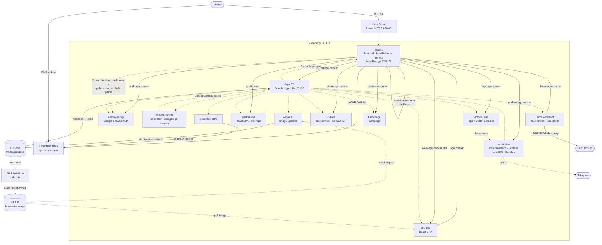

<div align="center">


# home 🏠

**Agu's home-lab GitOps repository** — Helm charts and ArgoCD applications for
services running on a Raspberry Pi with k3s.

</div>

## Stack

| Component | Role | Chart location |
|---|---|---|
| [Traefik](https://traefik.io/) | Ingress / load-balancer with automatic Let's Encrypt TLS (k3s-bundled, configured via this repo) | `charts/traefik-config/` |
| [Argo CD](https://argo-cd.readthedocs.io/) | GitOps continuous delivery (Google login via bundled Dex/OIDC) | `charts/argocd/` |
| [oauth2-proxy](https://oauth2-proxy.github.io/oauth2-proxy/) | Google sign-in gate for the Traefik dashboard (Traefik ForwardAuth) | `charts/oauth2-proxy/` |
| [Home Assistant](https://www.home-assistant.io/) | Home automation | `charts/home-assistant/` |
| [nginx](https://nginx.org/) | Serves the `agu.com.ar` SPA (built from `site/` into a GHCR image) | `charts/agu-spa/` |
| [nginx](https://nginx.org/) | Serves the `yaskia.com` SPA — chart + source live in the separate [`frodoagu/yaskia`](https://github.com/frodoagu/yaskia) repo; only the ArgoCD `Application` lives here | `apps/yaskia-spa.yaml` |
| [Argo CD Image Updater](https://argocd-image-updater.readthedocs.io/) | Auto-updates the SPA image — pins new digests into git | `charts/argocd-image-updater/` |
| [cloudflare-ddns](https://github.com/favonia/cloudflare-ddns) | Dynamic DNS – keeps Cloudflare records on the home public IP | `charts/cloudflare-ddns/` |
| [VictoriaMetrics + Grafana](https://docs.victoriametrics.com/) | Lightweight monitoring — metrics, dashboards, RPi temp/throttling, blackbox uptime, Telegram alerts | `charts/monitoring/` |
| [Pi-hole](https://pi-hole.net/) | Network-wide DNS ad-blocker + LAN DHCP server (hostNetwork) | `charts/pihole/` |
| [VictoriaLogs](https://docs.victoriametrics.com/victorialogs/) | Cluster-wide log aggregation (single node) + bundled Vector collector; queryable from Grafana | `charts/victoria-logs/` |
| [Sealed Secrets](https://github.com/bitnami-labs/sealed-secrets) | Commit **encrypted** secrets to git; the in-cluster controller decrypts them | `charts/sealed-secrets/` |
| [homepage](https://gethomepage.dev/) | Dashboard / start page for the lab (Google sign-in gated) | `charts/homepage/` |

## Architecture



ArgoCD manages all deployments using the [App of Apps](https://argo-cd.readthedocs.io/en/stable/operator-manual/cluster-bootstrapping/) pattern – every chart in this repo is declared as an `Application` under `apps/`.

## Prerequisites

- Raspberry Pi (tested on RPi 4) running [k3s](https://k3s.io/)
- `kubectl` and `helm` CLI configured to reach the cluster
- The `agu.com.ar` zone hosted on [Cloudflare](https://www.cloudflare.com/) and
  a Cloudflare API token with **Zone:DNS:Edit**. The `cloudflare-ddns` app
  creates/updates these A records to track the home public IP:
  - `agu.com.ar` → agu-spa (apex static site)
  - `www.agu.com.ar` → 301 redirect to `agu.com.ar`
  - `home.agu.com.ar` → Home Assistant
  - `argocd.agu.com.ar` → Argo CD
  - `traefik.agu.com.ar` → Traefik dashboard
  - `auth.agu.com.ar` → oauth2-proxy (Google sign-in for the dashboard)
  - `grafana.agu.com.ar` → Grafana (monitoring, gated by the same Google sign-in)
  - `logs.agu.com.ar` → VictoriaLogs UI (google-auth gated)
  - `dash.agu.com.ar` → homepage start page (google-auth gated)
  - `pihole.agu.com.ar` → Pi-hole admin UI (google-auth gated)
- A **second zone**, `yaskia.com`, if you run the `yaskia-spa` app. The same
  `cloudflare-ddns` updater also tracks `yaskia.com` / `www.yaskia.com`, so the
  DDNS token must have **Zone:DNS:Edit on both zones** (one token scoped to both,
  or drop the `yaskia.com` entries from `charts/cloudflare-ddns/values.yaml`).
- Router port-forwarding: **TCP 80** and **TCP 443** → RPi local IP

## Setup from a fresh Raspberry Pi OS

These steps take a brand-new RPi to a running k3s cluster ready for the Quick
start below. Run them on the Pi (or over SSH).

### 1 – Flash and boot Raspberry Pi OS

Flash **Raspberry Pi OS Lite (64-bit)** with [Raspberry Pi Imager](https://www.raspberrypi.com/software/).
In the imager's advanced options (⚙️) set the hostname, enable SSH, and
configure the user/Wi-Fi so you can log in headless. Then boot the Pi and SSH in:

```bash
ssh <user>@<pi-ip>
```

### 2 – Base system prep

```bash
# Update the OS
sudo apt update && sudo apt full-upgrade -y

# Enable cgroup memory (required by k3s) – append to the kernel cmdline
sudo sed -i '1 s/$/ cgroup_memory=1 cgroup_enable=memory/' /boot/firmware/cmdline.txt

# A static IP / DHCP reservation for the Pi is strongly recommended so your
# router port-forwarding and DNS records stay valid.
sudo reboot
```

### 3 – Install k3s

This repo uses the **Traefik bundled with k3s** (configured later via a
`HelmChartConfig`), so install k3s with its defaults — no `--disable` needed.
The bundled ServiceLB (klipper) gives Traefik's `LoadBalancer` service the
Pi's IP.

```bash
curl -sfL https://get.k3s.io | sh -s - --write-kubeconfig-mode 644

# Verify the node is Ready and Traefik is running
sudo k3s kubectl get nodes
sudo k3s kubectl -n kube-system get deploy traefik
```

### 4 – Install kubectl & Helm and grab the kubeconfig

```bash
# Helm
curl -fsSL https://raw.githubusercontent.com/helm/helm/main/scripts/get-helm-3 | bash

# kubectl — k3s ships it as `k3s kubectl`, but the rest of this guide (and helm)
# calls plain `kubectl`, so put a standalone binary on PATH. RPi 4 is arm64:
curl -fsSLO "https://dl.k8s.io/release/$(curl -fsSL https://dl.k8s.io/release/stable.txt)/bin/linux/arm64/kubectl"
sudo install -m 0755 kubectl /usr/local/bin/kubectl && rm kubectl

# Point kubectl/helm at the k3s cluster
mkdir -p ~/.kube
sudo cp /etc/rancher/k3s/k3s.yaml ~/.kube/config
sudo chown "$(id -u):$(id -g)" ~/.kube/config
export KUBECONFIG=~/.kube/config   # add to ~/.bashrc to persist across sessions
```

### 5 – Clone this repo

```bash
git clone https://github.com/frodoagu/home.git
cd home
```

You're now ready for the Quick start below.

## Quick start

### 1 – Install ArgoCD

```bash
helm repo add argo https://argoproj.github.io/argo-helm
helm repo update
helm upgrade --install argocd charts/argocd \
  --namespace argocd --create-namespace \
  --dependency-update
```

### 2 – Give ArgoCD access to the Git repo

Every `apps/*.yaml` (and `apps/root.yaml`) uses the **SSH** remote
`git@github.com:frodoagu/home.git`, so ArgoCD needs an SSH key to read it — even
for a public repo, SSH always authenticates. Add a **read-only deploy key** for
your fork to ArgoCD (skip this only if you switch every `repoURL` to an
anonymous `https://…` URL of a public repo):

```bash
ssh-keygen -t ed25519 -f argocd-repo -N '' -C 'argocd@home'
# Add the PUBLIC key (argocd-repo.pub) as a Deploy key on the GitHub repo
# (Settings → Deploy keys). Read-only is enough for sync; Image Updater
# write-back uses git-creds (a PAT) separately.
kubectl -n argocd create secret generic repo-home \
  --from-literal=type=git \
  --from-literal=url=git@github.com:frodoagu/home.git \
  --from-file=sshPrivateKey=argocd-repo
kubectl -n argocd label secret repo-home argocd.argoproj.io/secret-type=repository
rm argocd-repo argocd-repo.pub   # private key now lives only in-cluster
```

### 3 – Bootstrap the stack (App of Apps)

Edit the `repoURL` in `apps/root.yaml` (and the other app manifests) to match your fork, then:

```bash
kubectl apply -f apps/root.yaml
```

ArgoCD applies the Traefik `HelmChartConfig` (k3s redeploys Traefik with
Let's Encrypt + the dashboard) and deploys the rest: `sealed-secrets`,
`oauth2-proxy`, Home Assistant, `agu-spa`, `yaskia-spa`, `argocd-image-updater`,
`cloudflare-ddns`, `monitoring`, `victoria-logs`, `homepage`, and `pihole`.
Workloads whose secrets aren't decrypted yet stay `Synced`/crash-loop until the
next step provides the Sealed Secrets key.

### 4 – Provision secrets

**You almost never run `kubectl create secret` here.** Every credential the stack
needs is committed **encrypted** as a `SealedSecret`
(`charts/<chart>/templates/<name>-sealed.yaml`); the `sealed-secrets` controller
deployed in the previous step decrypts each into a real Secret automatically. So
bootstrapping secrets means **giving the controller the right private key**, not
creating ten secrets by hand.

**If you have a controller-key backup** (existing cluster, re-flash, or you saved
the key — see the warning below), restore it and let every SealedSecret decrypt:

```bash
kubectl apply -f sealed-secrets-key.backup.yaml          # the off-repo backup
kubectl -n kube-system rollout restart deploy/sealed-secrets-controller
```

That's it — the committed SealedSecrets unseal into real Secrets and the
crash-looping workloads self-heal.

**If this is a brand-new fork** (no backup, and the committed blobs were sealed
with someone else's key), you instead **mint each secret once and re-seal it into
your repo**. [docs/secrets.md](docs/secrets.md) has the full list (Cloudflare
tokens, the Google OAuth client for oauth2-proxy + ArgoCD Dex, GHCR/`git-creds`
for the SPA pipeline, Telegram, optional Home Assistant HomeGraph) with the exact
`kubectl create secret … | kubeseal` command for each. Two external setup steps
aren't k8s secrets and are still required either way:

- **Google OAuth client** — add the redirect URIs
  `https://auth.agu.com.ar/oauth2/callback` and
  `https://argocd.agu.com.ar/api/dex/callback` in the Cloud Console (one client
  backs both oauth2-proxy and ArgoCD Dex). See [docs/secrets.md](docs/secrets.md).
- **Telegram `chat_id`** — set it in `charts/monitoring/values.yaml` (only the
  bot token is a secret).

> ⚠️ **Back up the controller's private key** — losing it makes every committed
> `SealedSecret` permanently unrecoverable:
>
> ```bash
> kubectl get secret -n kube-system \
>   -l sealedsecrets.bitnami.com/sealed-secrets-key -o yaml > sealed-secrets-key.backup.yaml
> ```
>
> Store that file **off** the repo (it is the master decryption key). Full
> rotation, adoption, and re-seal workflow in [docs/secrets.md](docs/secrets.md).

Log in to the ArgoCD UI at `argocd.agu.com.ar` to watch everything converge
(initial admin password: `kubectl -n argocd get secret argocd-initial-admin-secret
-o jsonpath='{.data.password}' | base64 -d`).

### 5 – Customise values

Hosts and email are already set for `agu.com.ar`. If you fork to another
domain/repo, edit the `repoURL` in `apps/*.yaml` and the values below:

| Chart | Key values to change |
|---|---|
| `charts/traefik-config/values.yaml` | `acme.email`, `dashboard.host`, `googleAuth` (ForwardAuth gate) |
| `charts/oauth2-proxy/values.yaml` | `ingress.host`, `authenticatedEmailsFile.restricted_access` (allowed emails) |
| `charts/argocd/values.yaml` | `argo-cd.server.ingress.hostname`, `configs.cm.url`/`dex.config`, `configs.rbac.policy.csv` (admin emails) |
| `charts/home-assistant/values.yaml` | `ingress.host`, `externalUrl`, `env` (e.g. timezone), `hostNetwork`, `googleAssistant`; device config (ACs/TVs) is versioned under `charts/home-assistant/packages/` |
| `charts/agu-spa/values.yaml` | `ingress.host`, `image` + `content.source` (image vs. placeholder ConfigMap) |
| `charts/cloudflare-ddns/values.yaml` | `domains`, `proxied` |
| `charts/monitoring/values.yaml` | `ingress.host` (Grafana), `blackboxTargets`, Alertmanager `chat_id`, retention/resources |
| `charts/victoria-logs/values.yaml` | `ingress.host`, `victoria-logs-single.server.retentionPeriod`/`retentionDiskSpaceUsage`, PVC `size` |
| `charts/homepage/values.yaml` | `ingress.host`, `config.*` (services/widgets/bookmarks/settings), `serviceDiscovery.enabled` |
| `charts/sealed-secrets/values.yaml` | `image.tag` (keep in sync with `Chart.yaml` appVersion), `resources` |

### 6 – Instant sync (optional Git webhook)

By default ArgoCD polls git every ~3 min. To deploy on push instead, point a
GitHub webhook at the ArgoCD server (already exposed at `argocd.agu.com.ar`):

```bash
gh api -X POST /repos/frodoagu/home/hooks \
  -f name=web -F active=true -f 'events[]=push' \
  -f config[url]=https://argocd.agu.com.ar/api/webhook \
  -f config[content_type]=json
```

No shared secret is configured — ArgoCD accepts the push event and refreshes the
affected apps immediately. An unauthenticated POST can only trigger a harmless
re-check (which ArgoCD does on its timer anyway). To require HMAC verification,
set `webhook.github.secret` in `argocd-secret` and add the same secret to the
webhook config (`-f config[secret]=...`).

## Repository layout

```
.
├── docs/                    # Per-topic guides (secrets, TLS, Home Assistant, Google Assistant)
├── apps/                    # ArgoCD Application manifests
│   ├── root.yaml            # App-of-apps bootstrap entry point
│   ├── traefik.yaml
│   ├── argocd.yaml
│   ├── argocd-image-updater.yaml
│   ├── oauth2-proxy.yaml
│   ├── sealed-secrets.yaml
│   ├── home-assistant.yaml
│   ├── agu-spa.yaml
│   ├── yaskia-spa.yaml      # 2nd SPA — chart lives in the external frodoagu/yaskia repo
│   ├── cloudflare-ddns.yaml
│   ├── monitoring.yaml
│   ├── victoria-logs.yaml
│   ├── homepage.yaml
│   └── pihole.yaml
├── site/                    # Source for the agu.com.ar SPA (Vite + React) → built to a GHCR image by CI
└── charts/
    ├── traefik-config/      # HelmChartConfig for the k3s-bundled Traefik (ACME, dashboard, auth)
    ├── argocd/              # Argo CD wrapper (upstream chart)
    ├── argocd-image-updater/ # Argo CD Image Updater wrapper (auto-deploys new SPA image digests)
    ├── oauth2-proxy/        # Google ForwardAuth backend gating the Traefik dashboard
    ├── sealed-secrets/      # Sealed Secrets controller (vendored) — decrypts committed SealedSecrets
    ├── home-assistant/      # Home Assistant Helm chart
    ├── agu-spa/           # nginx serving a static single-page app (apex agu.com.ar)
    ├── cloudflare-ddns/     # Cloudflare dynamic-DNS updater
    ├── monitoring/         # VictoriaMetrics + Grafana + blackbox (metrics, RPi temp/throttle, Telegram alerts)
    ├── victoria-logs/      # VictoriaLogs single-node + Vector collector (cluster-wide logs)
    ├── homepage/           # gethomepage start page (dash.agu.com.ar, google-auth gated)
    └── pihole/             # Pi-hole DNS ad-blocker + LAN DHCP server (hostNetwork)
```

> `yaskia-spa` has no `charts/` entry here — its Helm chart and site source live
> in the separate [`frodoagu/yaskia`](https://github.com/frodoagu/yaskia) repo;
> only its ArgoCD `Application` ([apps/yaskia-spa.yaml](apps/yaskia-spa.yaml))
> lives in this repo, pointing ArgoCD at that external chart.

## Releases & commit conventions

Commits follow [Conventional Commits](https://www.conventionalcommits.org/), which
drives automated tagging and releases:

- **Squash-merge only.** The repo allows only squash-merge, and is configured so the
  **PR title becomes the squash commit** on `main`. The PR title therefore **must**
  be a Conventional Commit — [`.github/workflows/pr-lint.yml`](.github/workflows/pr-lint.yml)
  fails the PR otherwise (so `feat: add playlist`, not `add playlist`).
- **Auto tag + release.** On push to `main`,
  [`.github/workflows/release.yml`](.github/workflows/release.yml) reads the
  Conventional Commits since the last tag and cuts the next semver tag + a GitHub
  release (with a conventional-commit changelog):

  | Commit type | Bump |
  |---|---|
  | `feat:` | minor |
  | `fix:` | patch |
  | `feat!:` / `BREAKING CHANGE:` | major |
  | `build:` / `chore:` / `docs:` / Image Updater write-backs | none (no release) |

- **Tags are bookkeeping only** — nothing deploys off them. ArgoCD still syncs
  `main` directly and the SPA image still updates by digest; releases just give a
  human-readable changelog.

Versioning started from a `v0.0.0` genesis tag; the first release is `v1.0.0`.

## Documentation

Per-topic guides live in [docs/](docs/):

- [docs/monitoring.md](docs/monitoring.md) — VictoriaMetrics + Grafana stack: dashboards, Telegram alerts, blackbox probing, Traefik metrics, operating notes
- [docs/secrets.md](docs/secrets.md) — every secret as a committed `SealedSecret`: the controller-key bootstrap, minting/rotation/adoption, and the off-repo key backup
- [docs/tls.md](docs/tls.md) — Let's Encrypt via the DNS-01 Cloudflare challenge
- [docs/home-assistant.md](docs/home-assistant.md) — config bootstrap, versioned device config (HA packages: split-AC climate via SmartIR/Broadlink, unified webOS+IR TVs + WoL), device discovery (host networking), Bluetooth
- [docs/google-assistant.md](docs/google-assistant.md) — Google Home / `google_assistant` integration runbook
- [docs/agu-spa.md](docs/agu-spa.md) — static SPA chart + the `site/` app: dev/tests (Vitest), public vs. private (Google sign-in), image vs. placeholder content, SPA routing fallback
- [docs/pihole.md](docs/pihole.md) — Pi-hole DNS ad-blocker + LAN DHCP server: hostNetwork, the static-IP cold-boot requirement, phased rollout, static MAC→IP reservations
- [docs/email-migration.md](docs/email-migration.md) — **design/runbook (not yet deployed)** for self-hosting `fede@agu.com.ar` off Google Workspace (Stalwart + SES relay)

## Let's Encrypt notes

The bundled Traefik obtains certificates from Let's Encrypt using the **DNS-01**
challenge via Cloudflare (configured in `charts/traefik-config`). DNS-01 is used
because the global HTTP→HTTPS redirect would bounce an HTTP-01 challenge to
`:443` and fail it; DNS-01 needs no inbound port. It requires the
`traefik-cloudflare-token` secret (see [docs/secrets.md](docs/secrets.md)).

ACME certificates are stored in a PersistentVolume (`/data/acme.json`) so they
survive Traefik restarts. Full details and troubleshooting in
[docs/tls.md](docs/tls.md).
