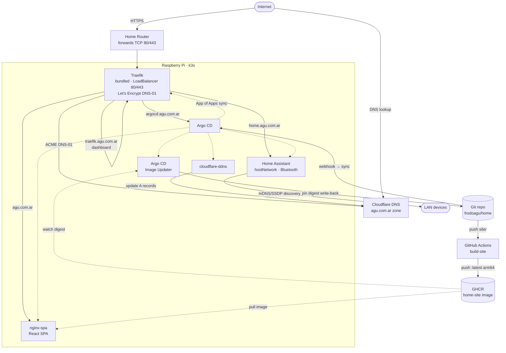

<div align="center">


# home 🏠

**Agu's home-lab GitOps repository** — Helm charts and ArgoCD applications for
services running on a Raspberry Pi with k3s.

</div>

## Stack

| Component | Role | Chart location |
|---|---|---|
| [Traefik](https://traefik.io/) | Ingress / load-balancer with automatic Let's Encrypt TLS (k3s-bundled, configured via this repo) | `charts/traefik-config/` |
| [Argo CD](https://argo-cd.readthedocs.io/) | GitOps continuous delivery | `charts/argocd/` |
| [Home Assistant](https://www.home-assistant.io/) | Home automation | `charts/home-assistant/` |
| [nginx](https://nginx.org/) | Serves the `agu.com.ar` SPA (built from `site/` into a GHCR image) | `charts/nginx-spa/` |
| [Argo CD Image Updater](https://argocd-image-updater.readthedocs.io/) | Auto-updates the SPA image — pins new digests into git | `charts/argocd-image-updater/` |
| [cloudflare-ddns](https://github.com/favonia/cloudflare-ddns) | Dynamic DNS – keeps Cloudflare records on the home public IP | `charts/cloudflare-ddns/` |

## Architecture



ArgoCD manages all deployments using the [App of Apps](https://argo-cd.readthedocs.io/en/stable/operator-manual/cluster-bootstrapping/) pattern – every chart in this repo is declared as an `Application` under `apps/`.

## Prerequisites

- Raspberry Pi (tested on RPi 4) running [k3s](https://k3s.io/)
- `kubectl` and `helm` CLI configured to reach the cluster
- The `agu.com.ar` zone hosted on [Cloudflare](https://www.cloudflare.com/) and
  a Cloudflare API token with **Zone:DNS:Edit**. The `cloudflare-ddns` app
  creates/updates these A records to track the home public IP:
  - `agu.com.ar` → nginx-spa (apex static site)
  - `home.agu.com.ar` → Home Assistant
  - `argocd.agu.com.ar` → Argo CD
  - `traefik.agu.com.ar` → Traefik dashboard
- Router port-forwarding: **TCP 80** and **TCP 443** → RPi local IP

## Setup from a fresh Raspberry Pi OS

These steps take a brand-new RPi to a running k3s cluster ready for the Quick
start below. Run them on the Pi (or over SSH).

### 1 – Flash and boot Raspberry Pi OS

Flash **Raspberry Pi OS Lite (64-bit)** with [Raspberry Pi Imager](https://www.raspberrypi.com/software/).
In the imager's advanced options (⚙️) set the hostname, enable SSH, and
configure the user/Wi-Fi so you can log in headless. Then boot the Pi and SSH in:

```bash
ssh <user>@<pi-ip>
```

### 2 – Base system prep

```bash
# Update the OS
sudo apt update && sudo apt full-upgrade -y

# Enable cgroup memory (required by k3s) – append to the kernel cmdline
sudo sed -i '1 s/$/ cgroup_memory=1 cgroup_enable=memory/' /boot/firmware/cmdline.txt

# A static IP / DHCP reservation for the Pi is strongly recommended so your
# router port-forwarding and DNS records stay valid.
sudo reboot
```

### 3 – Install k3s

This repo uses the **Traefik bundled with k3s** (configured later via a
`HelmChartConfig`), so install k3s with its defaults — no `--disable` needed.
The bundled ServiceLB (klipper) gives Traefik's `LoadBalancer` service the
Pi's IP.

```bash
curl -sfL https://get.k3s.io | sh -s - --write-kubeconfig-mode 644

# Verify the node is Ready and Traefik is running
sudo k3s kubectl get nodes
sudo k3s kubectl -n kube-system get deploy traefik
```

### 4 – Install kubectl & Helm and grab the kubeconfig

```bash
# Helm
curl -fsSL https://raw.githubusercontent.com/helm/helm/main/scripts/get-helm-3 | bash

# Point kubectl/helm at the k3s cluster
mkdir -p ~/.kube
sudo cp /etc/rancher/k3s/k3s.yaml ~/.kube/config
sudo chown "$(id -u):$(id -g)" ~/.kube/config
export KUBECONFIG=~/.kube/config

# (k3s already provides kubectl as `k3s kubectl`; the line above lets the
#  standalone kubectl/helm binaries reach the cluster too.)
```

### 5 – Clone this repo

```bash
git clone https://github.com/frodoagu/home.git
cd home
```

You're now ready for the Quick start below.

## Quick start

### 1 – Install ArgoCD

```bash
helm repo add argo https://argoproj.github.io/argo-helm
helm repo update
helm upgrade --install argocd charts/argocd \
  --namespace argocd --create-namespace \
  --dependency-update
```

### 2 – Bootstrap the stack (App of Apps)

Edit the `repoURL` in `apps/root.yaml` (and other app manifests) to match your fork, then:

```bash
kubectl apply -f apps/root.yaml
```

ArgoCD applies the Traefik `HelmChartConfig` (k3s redeploys Traefik with
Let's Encrypt + the dashboard) and deploys the remaining apps (Home Assistant,
nginx-spa, argocd-image-updater, cloudflare-ddns).

### 3 – Create the required secrets

These hold credentials that must never live in git. See [docs/secrets.md](docs/secrets.md)
for the full list, keys, and rotation notes.

**Traefik ACME — Cloudflare token** (Zone:DNS:Edit on `agu.com.ar`; used for the
DNS-01 challenge — see [docs/tls.md](docs/tls.md)):

```bash
kubectl create secret generic traefik-cloudflare-token -n kube-system \
  --from-literal=CF_DNS_API_TOKEN='your-cloudflare-token'
```

**Traefik dashboard** (HTTP basic auth, in the bundled Traefik's namespace):

```bash
htpasswd -nb admin 'your-password' | \
  kubectl create secret generic traefik-dashboard-auth \
    -n kube-system --from-file=users=/dev/stdin
```

> Need `htpasswd`? Install it with `sudo apt install -y apache2-utils`.

**Cloudflare DDNS** (API token with Zone:DNS:Edit on `agu.com.ar`):

```bash
kubectl create namespace cloudflare-ddns
kubectl create secret generic cloudflare-ddns-token \
  -n cloudflare-ddns --from-literal=CLOUDFLARE_API_TOKEN='your-cloudflare-token'
```

The private SPA pipeline (`ghcr.io/frodoagu/home-site`) uses **one** GitHub
**classic Personal Access Token** for everything. Create it at
[github.com/settings/tokens](https://github.com/settings/tokens) with both
scopes:

- **`read:packages`** — pull the image / query its digest (GHCR has no usable
  fine-grained-token path for container pulls; use a *classic* token).
- **`repo`** — let Argo CD Image Updater push the digest write-back commit to
  this private repo.

**1. GHCR pull credentials** (`ghcr-creds`) — the same `docker-registry` secret
in **two** namespaces: one for the kubelet to pull (`nginx-spa`), one for Image
Updater to query the digest (`argocd`):

```bash
GHCR_PAT='your-classic-PAT-with-repo+read:packages'
for ns in nginx-spa argocd; do
  kubectl create namespace "$ns" --dry-run=client -o yaml | kubectl apply -f -
  kubectl -n "$ns" create secret docker-registry ghcr-creds \
    --docker-server=ghcr.io \
    --docker-username=frodoagu \
    --docker-password="$GHCR_PAT"
done
```

**2. Image Updater write-back credentials** (`git-creds`) — Image Updater commits
the pinned `latest@sha256:...` back to the repo over HTTPS, using the same token:

```bash
kubectl -n argocd create secret generic git-creds \
  --from-literal=username=frodoagu \
  --from-literal=password='your-classic-PAT-with-repo+read:packages'
```

> The write-back is already wired in the `ImageUpdater` CR
> ([charts/argocd-image-updater/templates/nginx-spa-imageupdater.yaml](charts/argocd-image-updater/templates/nginx-spa-imageupdater.yaml)):
> `method: git:secret:argocd/git-creds` plus an HTTPS `repository` override (the
> app's own `repoURL` is SSH, which a PAT can't drive). No further config needed
> once `git-creds` exists. The v1.x controller only reconciles `ImageUpdater`
> resources, so each app that wants auto-updates gets one of these CRs.
>
> _Prefer narrower scope?_ Drop `repo` from the token and instead give the Argo CD
> repository a **read-write deploy key**; then set the CR's `method: git` and the
> HTTPS `repository` back to the SSH remote so write-back uses it directly.

See [docs/secrets.md](docs/secrets.md) for rotation notes.

> The Google Assistant integration needs an extra secret (`ha-google-sa`) only
> if you enable it — see [docs/google-assistant.md](docs/google-assistant.md).

### 4 – Customise values

Hosts and email are already set for `agu.com.ar`. If you fork to another
domain/repo, edit the `repoURL` in `apps/*.yaml` and the values below:

| Chart | Key values to change |
|---|---|
| `charts/traefik-config/values.yaml` | `acme.email`, `dashboard.host` |
| `charts/argocd/values.yaml` | `argo-cd.server.ingress.hostname` |
| `charts/home-assistant/values.yaml` | `ingress.host`, `externalUrl`, `env` (e.g. timezone), `hostNetwork`, `googleAssistant` |
| `charts/nginx-spa/values.yaml` | `ingress.host`, `image` + `content.source` (image vs. placeholder ConfigMap) |
| `charts/cloudflare-ddns/values.yaml` | `domains`, `proxied` |

### 5 – Instant sync (optional Git webhook)

By default ArgoCD polls git every ~3 min. To deploy on push instead, point a
GitHub webhook at the ArgoCD server (already exposed at `argocd.agu.com.ar`):

```bash
gh api -X POST /repos/frodoagu/home/hooks \
  -f name=web -F active=true -f 'events[]=push' \
  -f config[url]=https://argocd.agu.com.ar/api/webhook \
  -f config[content_type]=json
```

No shared secret is configured — ArgoCD accepts the push event and refreshes the
affected apps immediately. An unauthenticated POST can only trigger a harmless
re-check (which ArgoCD does on its timer anyway). To require HMAC verification,
set `webhook.github.secret` in `argocd-secret` and add the same secret to the
webhook config (`-f config[secret]=...`).

## Repository layout

```
.
├── docs/                    # Per-topic guides (secrets, TLS, Home Assistant, Google Assistant)
├── apps/                    # ArgoCD Application manifests
│   ├── root.yaml            # App-of-apps bootstrap entry point
│   ├── traefik.yaml
│   ├── argocd.yaml
│   ├── argocd-image-updater.yaml
│   ├── home-assistant.yaml
│   ├── nginx-spa.yaml
│   └── cloudflare-ddns.yaml
├── site/                    # Source for the agu.com.ar SPA (Vite + React) → built to a GHCR image by CI
└── charts/
    ├── traefik-config/      # HelmChartConfig for the k3s-bundled Traefik (ACME, dashboard, auth)
    ├── argocd/              # Argo CD wrapper (upstream chart)
    ├── argocd-image-updater/ # Argo CD Image Updater wrapper (auto-deploys new SPA image digests)
    ├── home-assistant/      # Home Assistant Helm chart
    ├── nginx-spa/           # nginx serving a static single-page app (apex agu.com.ar)
    └── cloudflare-ddns/     # Cloudflare dynamic-DNS updater
```

## Documentation

Per-topic guides live in [docs/](docs/):

- [docs/secrets.md](docs/secrets.md) — all out-of-band secrets and how to create them
- [docs/tls.md](docs/tls.md) — Let's Encrypt via the DNS-01 Cloudflare challenge
- [docs/home-assistant.md](docs/home-assistant.md) — config bootstrap, device discovery (host networking), Bluetooth
- [docs/google-assistant.md](docs/google-assistant.md) — Google Home / `google_assistant` integration runbook
- [docs/nginx-spa.md](docs/nginx-spa.md) — static SPA chart + the `site/` app: dev/tests (Vitest), public vs. private (Google sign-in), image vs. placeholder content, SPA routing fallback

## Let's Encrypt notes

The bundled Traefik obtains certificates from Let's Encrypt using the **DNS-01**
challenge via Cloudflare (configured in `charts/traefik-config`). DNS-01 is used
because the global HTTP→HTTPS redirect would bounce an HTTP-01 challenge to
`:443` and fail it; DNS-01 needs no inbound port. It requires the
`traefik-cloudflare-token` secret (see [docs/secrets.md](docs/secrets.md)).

ACME certificates are stored in a PersistentVolume (`/data/acme.json`) so they
survive Traefik restarts. Full details and troubleshooting in
[docs/tls.md](docs/tls.md).
