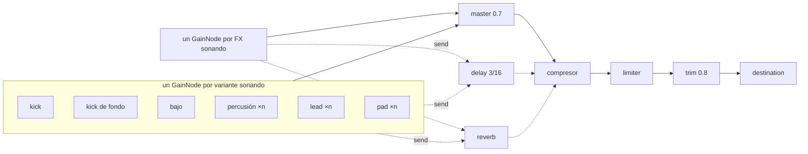
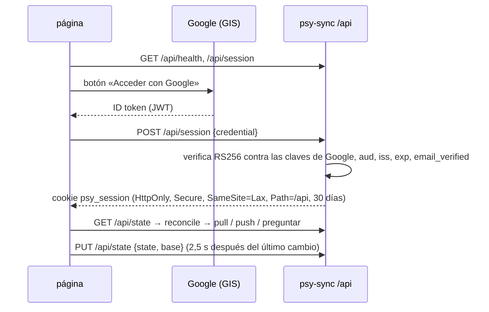

# psy-sampler

Sampler de capas de psytrance para entrenar el oído, en `https://psy.agu.com.ar`.
Cada botón pone en loop una capa (kick, bajo, percusión, lead, pad) sobre una
grilla de 32 semicorcheas (2 compases); los FX son one-shots fuera del loop.
**Todo es editable**: cada botón tiene un ▾ que abre su editor (pasos, notas,
sinte, perillas), y cualquier sonido se puede duplicar y renombrar. Un piloto
automático arma un tema solo a partir de una semilla compartible, y lo que suena
se exporta a WAV. Interfaz en español, inglés y portugués. Todo el audio se
sintetiza en el browser con Web Audio: el pod sólo sirve ~80 kB de estáticos.

| Pieza | Dónde |
|---|---|
| Código (Vite + JS vanilla, sin dependencias de runtime) | [`images/psy-sampler/`](../images/psy-sampler) |
| Guardado en la nube (Bun + SQLite) | [`images/psy-sync/`](../images/psy-sync) |
| Chart (nginx) | [`charts/psy-sampler/`](../charts/psy-sampler) |
| Argo CD Application | [`apps/psy-sampler.yaml`](../apps/psy-sampler.yaml) |
| Auto-update de la imagen | [`psy-sampler-imageupdater.yaml`](../charts/argocd-image-updater/templates/psy-sampler-imageupdater.yaml) |
| CI | [`psy-sampler-test.yml`](../.github/workflows/psy-sampler-test.yml) (lint + tests + build), [`psy-sampler-image.yml`](../.github/workflows/psy-sampler-image.yml) (imagen arm64 → GHCR), [`psy-sync-test.yml`](../.github/workflows/psy-sync-test.yml) y [`psy-sync-image.yml`](../.github/workflows/psy-sync-image.yml) (lo mismo para la API) |

## Motor de audio



### Scheduler (lookahead)

| Parámetro | Valor | Para qué |
|---|---|---|
| `TICK_MS` | 25 ms | período del `setInterval` |
| `LOOKAHEAD` | 120 ms | cuánto se agenda por delante de `ctx.currentTime` |
| `SAFETY` | 15 ms | nada se agenda más cerca que esto (ver gotchas) |
| `FADE` | 30 ms | fade lineal de un lane al cambiar variante (en el próximo paso) o al parar (ya) |
| `START_DELAY` | 60 ms | dónde cae el paso 0 al arrancar |

Cada tick lee `stepDuration(bpm) = 60 / BPM / 4`, así el slider aplica en vivo.
El tiempo del próximo paso siempre es el del anterior + la duración vigente
cuando se agendó, así que un cambio de BPM sólo estira los pasos desde el cursor:
lo ya agendado no se mueve y la grilla no deriva. Medido en Chromium (145 → 175
BPM): intervalos de kick de ~413 ms, **un** beat de transición intermedio (p. ej.
378 ms = dos semicorcheas ya agendadas a 145 + dos a 175) y después ~343 ms.

La lógica pura (`collectSteps`, `nextBeatTime`) vive en
[`timing.js`](../images/psy-sampler/src/audio/timing.js), sin Web Audio, y está
testeada aparte.

### Cambios en la línea de compás

`engine.onBar(fn)` registra un callback que el scheduler llama justo antes de
encolar el primer paso de cada compás (pasos 0 y 16), con su tiempo. Si devuelve
un mapa de lanes, esos lanes entran **exactamente en ese paso**: sin backfill,
el lane viejo hace su fade ahí mismo. Un mapa vacío hace el fade de todo en el
compás y deja que el timer se apague solo. Por ahí pasan las cosas que
tienen que caer en la grilla:

- **Entrar a tiempo** (switch, prendido por defecto): con el loop andando, un
  clic no cambia nada todavía; la selección nueva queda en cola (borde punteado
  que late en lo que entra, fill que late en lo que sale) y se aplica en el
  próximo compás. Volver a clickear antes del compás cancela la cola. Con el
  loop parado, o con el switch apagado, el clic aplica ya, como antes.
  **Doble clic** en un cuadradito se saltea la espera: el segundo clic (el
  `detail` 2 del evento) aplica ya lo que pedía el primero y vacía la cola; sin
  espera de por medio no hace nada, así no prende-apaga-prende.
- **Piloto automático** (ver abajo), en cada inicio de loop.
- **🔀 Improvisar** de los editores, en cada inicio de loop.
- **⏫ Build-up** de los kicks: toma el compás siguiente y lo devuelve en el
  otro (ver abajo).

`triggerFx(id, at)` acepta un tiempo, así el piloto dispara FX sobre la misma
línea de compás.

### Por qué lanes y no cancelar notas

Las notas de la variante vieja que ya están agendadas (hasta 120 ms adelante) y
las colas largas (pad, lead) no se tocan una por una: al cambiar de variante el
**lane entero** hace un fade de 30 ms y se abre uno nuevo. Las notas viejas suenan
dentro del fade y mueren solas.

- El lane nuevo hace **backfill** de los pasos que ya estaban en la ventana de
  lookahead (respetando `SAFETY`), así la variante nueva entra en el paso
  siguiente en vez de dejar un hueco de hasta 120 ms.
- El fade del lane viejo arranca **en ese mismo paso**, no en el clic: el cambio
  es un crossfade cuantizado a la grilla, sin hueco de silencio entre variantes.
  `Parar` sí corta ya (fade inmediato).
- Las notas largas (pad, lead melódico, drone) al entrar a mitad de frase
  arrancan con lo que les queda (`eventsAt(…, entering)`), en vez de esperar
  hasta 2 compases en silencio. Vale para cualquier nota de más de un paso,
  también las que escribís en el editor.

Selección → lanes es un reconcile puro
([`selection.js`](../images/psy-sampler/src/selection.js)): `desiredLanes()`
calcula el estado deseado y `engine.setLanes()` cierra/abre la diferencia.
**Kick y bajo son exclusivos** (un lane por capa: una segunda variante reemplaza
a la primera, dos kicks o dos bajos sólo embarran); **percusión, lead y pad se
apilan** (un lane por variante, `laneKey()`). El kick de fondo es un lane
derivado: suena sólo si hay otra capa activa y ninguna variante de kick elegida.

### Delay y reverb

Envíos post-lane (siguen los fades del lane) a dos buses compartidos, con switch
global en el transporte (el return hace un glide de 30 ms):

| | delay | reverb |
|---|---|---|
| percusión | — | 0,12 |
| lead | 0,3 | 0,25 |
| pad | — | 0,4 |
| FX | 0,2 | 0,35 |

Kick y bajo van secos: una cola debajo sólo embarra el grave. El delay es de
**3/16** (corchea con puntillo, el eco clásico del psy), feedback 0,38 a través
de un LP 2,5 kHz (cada repetición más oscura), y sigue al BPM con un glide de
50 ms (un salto de `delayTime` hace clic). El reverb es un `ConvolverNode` con un
impulso sintético: 2,4 s de ruido estéreo con caída cúbica.

## Datos editables

Lo que toca cada variante es **dato**, no código
([`patterns.js`](../images/psy-sampler/src/audio/patterns.js), `DEFAULTS`):

| Tipo | Dato | Editor |
|---|---|---|
| `drum` (kick, percusión) | `steps`: 32 × apagado / golpe / acento + params de la voz | una fila de 32 pasos + perillas |
| `notes` (bajo, lead, pad, toms) | `notes: [{step, midi, len, accent}]`, `synth`, `params.bright`, `scale`, `transpose`, `len` | piano roll + sinte + brillo + escala + octava + largo de nota nueva |
| `fx` | `params` (largo en compases, rango, decay…) | perillas + ▶ Disparar |

Todas tienen además **Volumen** (`level`, 0-150 % del nivel de su capa) y
**Restaurar**. `eventsAt(id, step, entering, data)` convierte el dato en eventos
en cada paso; `engine.setData(id, data)` lo reemplaza y el scheduler lo lee en el
siguiente paso agendado (≤ 120 ms), sin reabrir el lane. Un cambio de volumen
hace un glide de 20 ms en los lanes que tocan esa variante. Las perillas
(`params.js`) guardan unidades de la voz (Hz, s, compases) y sólo formatean al
mostrar.

- **Clic** en un paso o celda: vacío → golpe/nota → acento → vacío. Las notas
  nuevas miden lo que diga «Nota nueva» (se acortan para no pisar la siguiente
  de la fila ni pasar el final del loop). **Arrastrar** con el mouse a lo largo de
  una fila pinta una nota larga; en touch el arrastre es scroll del piano roll, y
  un tap agrega una nota.
- **Editar algo que no suena lo prende** (según el modo solo/combinar): lo que
  editás es lo que escuchás. Al agregar una nota se previsualiza al toque
  (`engine.audition`), salvo golpes de batería con el loop andando (un golpe
  fuera de la grilla sólo suena a error).
- **🔀 Improvisar** es un toggle: mientras está prendido, en cada inicio de loop
  la parte cambia un poco (`varyNotes` / `varySteps` en `editing.js`: mover una
  nota a la fila vecina, dar vuelta un acento, un eco unos pasos después o sacar
  una; en batería sólo golpes fuera del beat, el pulso no se mueve). Cada
  variación sale de **lo que escribiste**, no de la variación anterior, así
  respira alrededor de la parte sin irse a la deriva; las variaciones van sólo al
  motor, nunca al storage, y al apagarlo vuelve tu parte. Sigue andando con el
  editor cerrado (el cuadradito muestra 🔀). **Restaurar** también lo apaga.
- **×2 golpes** (batería) agrega un golpe a mitad de camino entre cada golpe y
  el siguiente (dando la vuelta al loop): negras → corcheas → semicorcheas.
  Un hueco de un paso no tiene mitad y queda igual. Es una edición: se guarda.
- **⏫ Build-up** (sólo kicks) arma un redoble para el próximo compás que va
  duplicando la densidad: medio compás de negras, un cuarto de corcheas y
  cuatro semicorcheas con acento (`BUILD_UP` en `editing.js`). Se arma con el
  toggle (prende el kick si no sonaba, como cualquier edición), entra en la
  línea de compás y en la siguiente vuelve solo; volver a tocarlo lo cancela.
  Es una capa encima de lo que suena (`feed()` en `app.js`): tus ediciones y las
  variaciones de Improvisar siguen por debajo, y nunca va al storage.
- **🎲 Nueva parte** escribe una parte nueva en la escala elegida, con hábitos del
  género por capa ([`editing.js`](../images/psy-sampler/src/editing.js)): bajo
  rolling entre kicks mayormente en la tónica, lead con un motivo de 8 pasos en
  forma A A' A B, pad con una tríada por compás, toms ralos con fill al final.
- Escalas en La: menor, **frigio** (Si♭, la tensión típica del psy), menor
  armónica y cromática. Las notas fuera de la escala elegida siguen visibles (en
  itálica) para poder borrarlas.
- **Un editor abierto a la vez**: abrir uno pliega el que estuviera abierto, en
  cualquier capa. Las grillas tienen encabezado de compás (1, 2) y de tiempo
  (1-4), los tiempos 2 y 4 sombreados y una regla entre los dos compases.

### Sonidos propios: duplicar y renombrar

**Duplicar** (en el editor) crea una copia justo al lado del original, la abre
y deja el nombre seleccionado para escribir el nuevo. Una copia tiene id
`<base>~n` (`kick.punchy~2`): `baseOf()` / `defOf()` en `patterns.js` resuelven
tipo, voz, rango y FX a través de la base, así el motor, el editor y el
`sanitize` no distinguen copias de originales. La copia arranca con los datos
actuales del original y después es independiente. El **Nombre** se edita en
vivo en cualquier sonido (también los de fábrica); vacío vuelve al nombre por
defecto. Sólo las copias se pueden borrar (**Borrar sonido**).

### Ordenar

Cada capa tiene una manija ⠿: arrastrar mueve la capa entera (o flechas ↑ ↓ con
la manija enfocada). Los cuadraditos se arrastran dentro de su capa: con mouse
apenas se mueven 6 px, en touch con un toque largo (350 ms), para que un swipe
siga scrolleando y un tap siga siendo un clic; con teclado, Alt + flechas.
Soltar nunca dispara el clic del sonido. Genérico en `ui/sortable.js`.

### Qué se guarda

Todo vive en un objeto, el **workspace** (`workspace.js`), en `localStorage`
(`psy-sampler:v2`, por browser): BPM, los switches, el orden de capas y de
cuadraditos, las copias, los nombres, los datos editados, la semilla y el
idioma. Lo único que no se guarda es qué está sonando (una carga de página
arranca en silencio: sin un clic no hay audio). `normalize()` es la única
puerta de entrada, para el storage y para un preset importado: revisa cada
campo y lo que no cierra vuelve al valor de fábrica, así que un dato viejo,
tocado a mano o ajeno nunca rompe el loop. Si el storage no está (modo privado),
funciona igual sin recordar.

**Restaurar todo** (con confirmación) vuelve todo a fábrica salvo el idioma.

### Exportar

- **⬇ Audio del mix**: WAV de 2 compases de lo que suena. **⬇ WAV** en cada
  editor: ese sonido solo (los FX, el one-shot con su cola). `engine.render()`
  arma la misma cadena de salida en un `OfflineAudioContext` a 48 kHz; un loop
  se renderiza **dos veces y se queda con la segunda pasada**, así las colas del
  final ya están envueltas en el principio y el archivo loopea sin costura en
  cualquier DAW. Un FX se renderiza 12 s y se recorta al silencio (-80 dBFS).
  24-bit estéreo (`audio/wav.js`).
- **Exportar / Importar preset**: el workspace + lo que suena, en JSON
  (`app: "psy-sampler"`). Importar lo reemplaza entero y pone a sonar su mix.

## Guardado en la nube

Cualquiera con cuenta de Google puede guardar su workspace en el servidor y
usarlo en otro dispositivo. El estado está **siempre a la vista** en la barra
superior (`ui/account.js`), junto al link de vuelta a agu.com.ar y el idioma:

| Pastilla | Cuándo |
|---|---|
| ☁ Nube… | todavía preguntando a la API |
| ☁ Nube no disponible (gris) | la API no responde; se reintenta cada 30 s y todo queda en el browser |
| ☁ Sólo en este browser (gris) + botón de Google | sin sesión |
| ☁ Cambios sin subir… / Guardando… (ámbar) | con sesión, subiendo |
| ☁ Guardado ✓ hh:mm (verde) | con sesión, la nube coincide con lo de acá |
| ☁ Sin conexión / Error / Cambios de otro dispositivo (rojo) | con sesión, algo falló |

Con sesión, el avatar abre un menú con el mail, **Salir** y **Borrar mis
datos**. Si el script de Google no carga (bloqueador, sin red) queda escrito
«Login no disponible» en vez de un hueco. En el celular la barra ocupa dos filas
y no queda fija.

El botón de Google es un iframe con un documento claro adentro: si el
`color-scheme` del iframe no coincide con el de ese documento, el browser le
pinta un fondo opaco blanco. Por eso `.gsi-slot` fuerza `color-scheme: light`,
y en modo oscuro el botón (`filled_black`) queda sin la caja blanca.



**Por qué no oauth2-proxy**: el `google-auth` del cluster es un allowlist que
abre los dashboards (Traefik, Grafana, Pi-hole, Shelly, logs); abrirlo a
cualquier mail no es opción, y un segundo oauth2-proxy significa otro
deployment, otra cookie y redirects que un `fetch` no sigue. En cambio la página
usa *Sign in with Google* (el mismo client OAuth que agu.com.ar) y la API
verifica el token ella misma y emite su propia cookie de sesión.

**API** ([`images/psy-sync`](../images/psy-sync), Bun sin dependencias:
`bun:sqlite` + WebCrypto):

| Ruta | |
|---|---|
| `GET /api/health` | `{ ok, clientId }`: la página decide si muestra la fila |
| `POST /api/session` | `{ credential }` → cookie |
| `GET /api/session` | `{ email }` (`null` sin sesión: no es un error en cada visita) |
| `DELETE /api/session` | salir |
| `GET /api/state` | `{ state, updatedAt }` o 404 |
| `PUT /api/state` | `{ state, base, force? }` → `{ updatedAt }`, o **409** con la copia guardada si `base` quedó viejo |
| `DELETE /api/account` | borra el usuario y su workspace |

- El server **no interpreta** el workspace: guarda un objeto JSON opaco (tope
  256 KB) y la página lo pasa por `normalize()` al traerlo, como a un preset.
- Escrituras: además de `SameSite=Lax`, el header `Origin` tiene que ser
  `https://psy.agu.com.ar`.
- La sesión es un HMAC sin estado (`sub.vencimiento.firma`); la clave se genera
  en el primer arranque en el volumen, al lado de la base: **no hay Secret que
  crear**. Borrar la cuenta borra la fila del usuario, y una cookie de un
  usuario que no existe no abre nada.
- Topes: `sync.maxUsers` (5000 cuentas; las existentes siguen entrando) y un
  `rateLimit` de Traefik por IP real (`Cf-Connecting-IP`, como Home Assistant)
  en la ruta `/api/`.

**Sincronización** ([`cloud.js`](../images/psy-sampler/src/cloud.js)): cada
browser recuerda, por cuenta, el `updatedAt` y un hash del contenido de la
última sincronización (`psy-sampler:cloud`). Al entrar:

| Nube | Acá | Qué hace |
|---|---|---|
| vacía | | sube lo de acá |
| igual contenido | | nada |
| donde la dejé | sin cambios / con cambios | nada / sube |
| más nueva | sin cambios (o de fábrica) | la baja |
| más nueva | con cambios | **pregunta** (Aceptar = la de la nube, Cancelar = pisarla con la de acá) |

Cada guardado local sube 2,5 s después del último cambio, con `base` = la
versión sobre la que se construyó; un 409 (otro dispositivo guardó en el medio)
hace la misma pregunta. Al ocultar la pestaña lo pendiente sube con
`keepalive`. Sin conexión queda local y sube con el próximo cambio.

**Infra** (en el chart `psy-sampler`, `sync.*` en `values.yaml`): un Deployment
aparte (si la API está caída, o su imagen todavía no es pública, el sitio
estático sigue andando y la página esconde la fila), `strategy: Recreate`
(SQLite en un volumen RWO), PVC de 2 Gi en `local-path` con
`helm.sh/resource-policy: keep` y `Prune=false`, contenedor sin root, root
filesystem de sólo lectura y sin capabilities.

### Puesta en marcha (una vez)

1. Google Cloud → APIs & Services → Credentials → el client OAuth de
   agu.com.ar → **Authorized JavaScript origins**: agregar
   `https://psy.agu.com.ar` (y `http://localhost:5173` para desarrollo). Sin eso
   el botón de Google no carga ("origin is not allowed for the given client ID").
2. Mergear; esperar `psy-sync-image.yml`; GitHub → Packages → `psy-sync` →
   **Public** (igual que `psy-sampler`). Hasta entonces el pod de la API queda
   en `ImagePullBackOff` y sólo la fila de la nube no aparece.

### Datos y backups

La base (`psy-sync.db`) y la clave de sesión viven en el PVC, en la SD del Pi.
**No hay backup automático**: perder la SD pierde las cuentas y lo guardado en
la nube (cada browser conserva su copia local, que se vuelve a subir al
entrar). Para copiar a mano:
`kubectl -n psy-sampler exec deploy/psy-sampler-sync -- cat /data/psy-sync.db > psy-sync.db`
(con WAL, mejor `sqlite3 .backup` si hace falta una copia consistente bajo
carga).

### Desarrollo

```bash
cd images/psy-sync && bun test
DATA_DIR=/tmp/psd GOOGLE_CLIENT_ID=<client> ALLOWED_ORIGINS=http://localhost:5173 bun src/server.js
cd images/psy-sampler && npm run dev   # Vite proxya /api a :8787
```

## Piloto automático y semillas

**🤖 Piloto automático** (`autopilot.js`) recorre las secciones de un tema y en
cada inicio de loop decide qué suena:

| Sección | Compases | Kick | Bajo | Perc | Lead | Pad | Al entrar |
|---|---|---|---|---|---|---|---|
| Intro | 8 | 1 | – | 1 | – | – | |
| Groove | 16 | 1 | 1 | 1-2 | – | – | a veces láser o sirena; 25 % bajo nuevo |
| Subida | 8 | 1 | 1 | 2 | 1 | – | 50 % lead nuevo; el último loop dispara un riser de 2 compases que cae en el Pico |
| Pico | 32 | 1 | 1 | 2-3 | 1 | 1 | crash o impacto |
| Break | 16 | – | – | 0-1 | 1 | 1 | downlifter; 60 % lead nuevo |

Después del Pico va al Break o al Groove; del Break a la Subida. Una variante
que suena sobrevive al cambio de sección con 75 %. Dentro de una sección, el
mix sólo puede cambiar en una línea de frase (cada 8 compases, `PHRASE`): ahí
hay un cambio chico (un sonido por otro de la misma capa) con 30 %. Así una
Intro o una Subida no se tocan, y un Pico tiene 3 oportunidades en 32 compases.
Toda sección dura frases enteras, como en un tema de verdad. Usa
también las copias. Mientras corre, el kick de fondo no suena (el Break es sin
kick). Clickear durante el piloto vale: sigue desde lo que elegiste.

**Semilla**: todas las decisiones salen de un PRNG (`seeded(hashSeed(semilla))`),
así **la misma semilla genera el mismo tema en cualquier browser**. Para que eso
sea cierto:

- Prender el piloto en silencio arranca de la Intro. Con algo sonando no
  empieza de nuevo: toma el mix tal cual, adivina en qué sección está
  (`guessSection`, por las capas que suenan) y sigue desde ahí con la semilla;
  el kick de fondo pasa a ser un kick real para que no se corte. Ese tema
  depende de la semilla *y* del mix de partida: para compartir uno
  reproducible, arrancá de silencio.
- Las partes que el piloto escribió (`ws.auto`) vuelven a fábrica al prenderlo
  desde silencio (sobre un mix sonando se quedan, para no cambiar lo que suena).
  Si editás una a mano pasa a ser tuya y el piloto no la toca más.
- Los pools se leen ordenados por id, nunca en el orden de los cuadraditos.
- Una parte nueva se calcula (y consume el PRNG) aunque no se aplique porque la
  editaste: tus ediciones cambian cómo suena, no la secuencia.

**🔗 Compartir** copia un link `#seed=…&bpm=…` y, si tenés sonidos editados o
duplicados, `&s=…`: esos sonidos como preset JSON, `deflate-raw` y base64url
(`share.js`), porque el tema sólo es el mismo con los mismos sonidos. Abrir el
link carga semilla y BPM (los sonidos, con confirmación si ya tenías los
tuyos), limpia el fragmento y avisa que se toque el piloto: el audio necesita
ese clic. 🎲 sortea una semilla nueva (6 caracteres sin 0/o/1/l/i).

## Idiomas

`i18n/{es,en,pt}.js` tienen todos los textos (capas, variantes, sintes,
perillas, escalas, nombres de nota: La/A/Lá) y `i18n.test.js` exige que los tres
tengan exactamente la misma forma. Por defecto, el idioma guardado; si no, el
del browser; si no, español. Cambiar de idioma reconstruye la app sin cortar lo
que suena (ni el piloto, ni la cola, ni el editor abierto).

## Pantalla

Vertical: una columna. Horizontal desde 1000 px: las capas en dos columnas
(tres desde 1800 px), cada una con el título arriba de sus cuadraditos. Celular
acostado (alto ≤ 500 px): dos columnas y sin la bajada del título. Nunca hay
scroll horizontal de página: las grillas de 32 pasos scrollean en su caja.

## Capas

| Capa | Variante | Qué es |
|---|---|---|
| Kick (exclusiva) | Punchy corto | seno 170→50 Hz en 70 ms, decay 200 ms + click de ruido HP 3 kHz |
| | Cuerpo largo | 120→42 Hz en 160 ms, decay 340 ms, sin click |
| | Tok hi-tech | 230→58 Hz en 35 ms, decay 120 ms |
| | Full-on gordo | 150→46 Hz en 100 ms, decay 260 ms, click al 60 % |
| Bajo (exclusiva, La1 = 55 Hz) | Offbeat | paso % 4 == 2 |
| | Rolling | paso % 4 != 0 (3 notas entre kicks) |
| | Rolling con octava | igual, la del paso % 4 == 2 una octava arriba |
| | Galope | pasos % 4 ∈ {2, 3}: K-BB |
| Percusión (se apilan) | Hi-hat abierto | contratiempo, HP 7 kHz, 140 ms |
| | Hi-hat cerrado | semicorcheas impares, HP 9 kHz, 35 ms |
| | Shaker | cada paso, acento en las corcheas |
| | Clap | beats 2 y 4, BP 1,8 kHz, doble ráfaga a 12 ms |
| | Snare | beats 2 y 4 con acento + redoble en los pasos 29-31 |
| | Ride | metal 808 (6 squares inharmónicas, BP 9 kHz), acento en el contratiempo |
| | Toms tribales | sinte `tom` en el piano roll, con fill al final |
| Lead (se apilan) | Ácido | 303: línea de 16 pasos en La menor con silencios y acentos; cutoff base que deriva 300 Hz ↔ 1,5 kHz cada 16 s (reloj de audio, no del loop) |
| | Arpegio | square, La-Do-Mi-La por semicorchea |
| | Arpegio 3/16 | pluck, ciclo de 3 notas contra la grilla de 4 |
| | Melódico | saw con vibrato retardado, una nota cada 8 pasos (La-Do-Sol-Mi) |
| | Stabs | supersaw, La-Do-Mi sincopado |
| Pad (se apilan) | La menor | La3-Do4-Mi4, re-dispara cada 16 pasos con release solapado |
| | Am → Si♭ | i → ♭II, el giro frigio |
| | Drone | La2 + Mi3, LP resonante con LFO de 0,12 Hz, 2 compases |
| | Viento | ruido BP afinado a 4× la nota, LFO lento |
| FX | Riser | ruido BP 300 Hz → «Hasta» (9 kHz) en «Largo» (2 compases) |
| | Riser + impacto | el impacto cae justo al final del riser |
| | Downlifter | ruido BP «Desde» (8 kHz) → 150 Hz + seno 400→40 Hz |
| | Sweep de ruido | BP angosto que sube a «Pico» y baja |
| | Impacto | seno «Tono» (90 Hz) → ×0,31 + ruido LP, decay 1,5 s |
| | Láser | saw 4 kHz → 60 Hz |
| | Crash | ruido HP 6 kHz, 2 s |
| | Sirena goa | saw 300 → 1200 Hz con vibrato |

Los FX duran según el BPM al momento del disparo. Con el loop andando entran en
el próximo beat; con el loop parado, ya.

### Sintes

Cualquier variante melódica puede tocar con cualquiera de estos
([`voices.js`](../images/psy-sampler/src/audio/voices.js) `INSTRUMENTS`). Todos
aceptan notas de cualquier largo, acento (+30 %) y «Brillo» (multiplica el
cutoff, tope 18 kHz):

| Grupo | Sinte | Patch |
|---|---|---|
| Bajos | Saw pluck | saw + LP que se cierra dentro del primer paso |
| | Sub | seno + triángulo una octava arriba |
| | FM bass | 2 operadores relación 1, índice 5 → 0,3 en 120 ms (estilo Operator) |
| | Reese | 2 saws ±12 cents + sub, LP 700 Hz |
| Leads | Acid 303 | saw + LP Q 14 con envolvente sobre el cutoff que deriva |
| | Supersaw | 5 saws a ±9/±18 cents (estilo Wavetable) |
| | Analog | 2 squares ±6 cents, LP con envolvente (estilo Analog) |
| | Pluck | saw + square, LP 6 kHz → 300 Hz (estilo Drift) |
| | Square | square percusiva |
| | Saw lead | saw sostenida con vibrato retardado |
| | FM bell | relación 3,5, índice que cae con la nota (estilo Operator) |
| | Zapper | cada nota cae 2 octavas en 40 ms |
| Pads | Saw pad / Drone / Viento | ver la tabla de capas |
| Percusión | Tom | seno que cae a 0,6× en 250 ms |

### Mezcla

Medido en Chrome (`OfflineAudioContext`, 2 vueltas a 145 BPM, lane → master):
los 16 sintes tocando la misma línea quedan entre **-19 y -28 dBFS RMS**;
Viento, FM bell, Zapper y Pluck se subieron 4-10 dB para que cambiar de sinte no
parezca que se apagó.

A la salida real (todos los nodos, tomado del destination):

| | pico dBFS |
|---|---|
| una capa sola (kick / bajo / ácido / pad) | -3,4 / -3,6 / -3,1 / -3,7 |
| **todo apilado**: 18 loops + riser+impacto + crash + impacto + sirena, con delay y reverb | -1,8 (0 muestras sobre 1,0) |

Sin limiter, el todo-apilado pasaba a +1,5 dBFS. El compresor está suave a
propósito (-10 dB, 4:1, knee 6, 3 ms / 150 ms: los defaults de Web Audio,
-24 dB 12:1, aplastarían la dinámica que una capa sola tiene que dejar oír);
atrás va un limiter (-1,5 dB, 20:1, knee 0, 1 ms / 80 ms) y un trim de 0,8.

## Deploy

Mismo pipeline que `agu-spa`: push a `main` que toque `images/psy-sampler/` →
`psy-sampler-image.yml` publica `ghcr.io/frodoagu/psy-sampler:latest` (+
`sha-<commit>`) → Image Updater pinea `latest@sha256:…` en
`charts/psy-sampler/values.yaml` → Argo CD sincroniza.

### Primer deploy: el paquete de GHCR tiene que ser público

`imagePullSecrets: []`: la imagen sólo contiene lo que cualquiera baja de
`psy.agu.com.ar`, así que no hay nada que proteger. GHCR crea el paquete
**privado** en el primer push; hasta cambiarlo el pod queda en `ImagePullBackOff`:

1. Mergear; esperar el run de `psy-sampler-image.yml`.
2. GitHub → Packages → `psy-sampler` → Package settings → Change visibility →
   **Public**.
3. El kubelet reintenta solo (backoff ≤ 5 min), o
   `kubectl -n psy-sampler rollout restart deploy/psy-sampler`.

Para dejarlo privado: sellar un `ghcr-creds` docker-registry en el namespace
`psy-sampler` (ver [secrets.md](secrets.md)) y listarlo en `imagePullSecrets`.

### DNS

- `psy.agu.com.ar` está en `cloudflare-ddns` (registro A, proxied).
- **No** está en los `localRecords` de Pi-hole, a propósito: esos registros se
  renderizan como env del Deployment de Pi-hole (`strategy: Recreate`), así que
  agregar un host reinicia Pi-hole y corta DNS + DHCP de la LAN durante el rollout.
  Para 20 kB de estáticos el atajo no aporta nada; desde la LAN resuelve a
  Cloudflare, igual que `shelly` y `yaskia.com`.
- Probe de blackbox (`blackboxTargets.public`) para uptime + vencimiento de TLS.
- Tarjeta en la grilla pública de `agu.com.ar` (entrada con `href` en `apps` de
  [`registry.jsx`](../images/home-site/src/apps/registry.jsx)).

## Desarrollo y tests

```bash
cd images/psy-sampler
npm install
npm run dev      # http://localhost:5173
npm run lint
npm test         # Vitest
npm run build
```

- Lógica pura en `.js` con su `*.test.js` al lado: `timing`, `patterns`, `music`,
  `selection`, `editing` (ciclos de clic, arrastre, improvisación y variaciones
  con PRNG con semilla), `workspace` (normalize, presets), `autopilot`
  (secciones, formas, determinismo por semilla), `share`, `wav`, `i18n`.
- `voices.test.js` / `engine.test.js` corren contra un `AudioContext` falso
  ([`src/test/fakeAudio.js`](../images/psy-sampler/src/test/fakeAudio.js)) que
  registra nodos y automatizaciones. Incluye un invariante anti-clic: toda fuente
  audible tiene que arrancar y terminar en ganancia 0 y no frenar antes de que su
  envolvente llegue a 0. Corre para cada variante, cada sinte con notas de 1 a
  32 pasos, y cada voz de batería y FX con sus perillas en el mínimo y el máximo.
- `app.test.js` (jsdom) cubre modo solo / combinar / apilar, la cola al compás,
  doble clic, Parar, kick de fondo, FX, los editores (clic, playhead, perillas,
  Restaurar, Improvisar, ×2, build-up, persistencia, storage roto), duplicar / renombrar / borrar,
  reordenar, piloto (misma semilla = mismo tema), idiomas, exportar / importar,
  WAV, Restaurar todo y los links compartidos.
- Las devDependencies (Vite 8, Vitest 5, jsdom 29) son más nuevas que las de
  `home-site`: las de allá arrastran advisories críticos en el toolchain de test.

## Gotchas

- **Nada se agenda en el pasado.** Una nota cuyo `start` ya pasó cuando la ve el
  audio thread arranca a mitad de la envolvente (ganancia ≠ 0): clic. Por eso
  `SAFETY` aplica al backfill y al catch-up.
- **Pestaña en segundo plano.** Chrome lleva los timers a ≥ 1 s por tick; el
  scheduler salta los pasos perdidos manteniendo la fase de la grilla (no dispara
  el backlog de golpe), pero el loop suena entrecortado. Es una limitación del
  `setInterval` en el main thread; moverlo a un Worker la resolvería.
- **`AudioContext` recién en el primer clic** (autoplay policy). `ensureContext()`
  se llama sincrónico dentro del handler y hace `resume()` si está `suspended`.
- **Makeup gain automático.** El `DynamicsCompressor` de Chrome sube la salida
  según threshold/ratio; con dos en serie la ganancia neta subía ~2 dB y una capa
  sola llegaba a -1,3 dBFS. El trim de 0,8 después del limiter lo compensa.
  Medir a la salida real antes de tocar threshold o ratio.
- **Una voz nueva** necesita: la función en `voices.js` (en `INSTRUMENTS` si es
  melódica, con entrada en `SYNTHS` de `params.js`; si es de batería, su spec en
  `PARAMS`), y pasar el invariante anti-clic. Los tests fallan si un sinte de la
  lista no tiene voz o al revés.
- **`listen [::]:80`** en la config de nginx (como `agu-spa`) falla en un host sin
  IPv6 (p. ej. un Docker de prueba); en el Pi anda.
