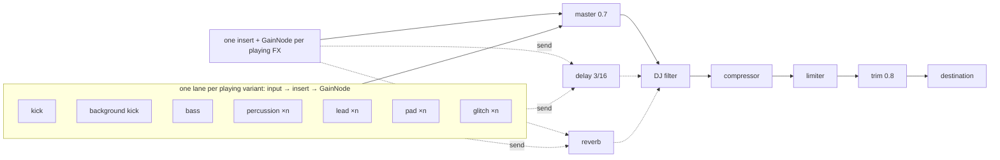
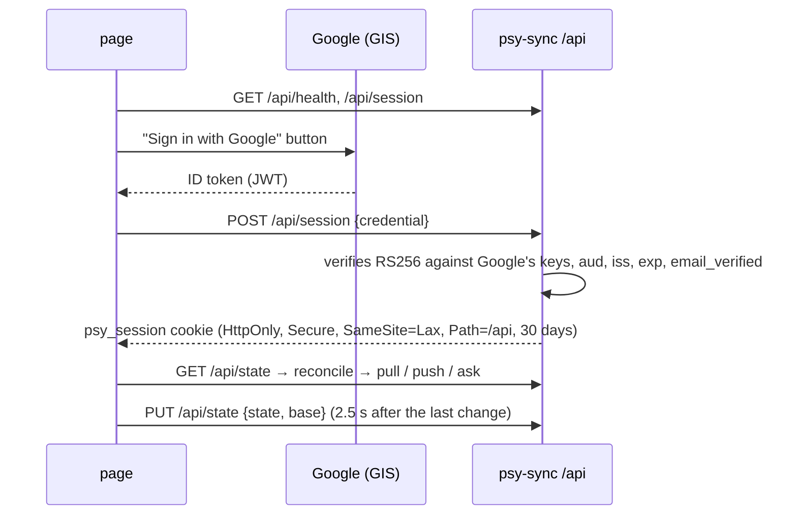

# psy-sampler

A live electronic music machine at `https://psy.agu.com.ar`. Each button loops a
layer (kick, bass, percussion, lead, pad, glitch; 9-11 sounds per layer) over a
grid of 32 sixteenths (2 bars); FX are one-shots outside the loop. **Everything
is editable**: every button has a ▾ that opens its editor (steps, notes, synth,
knobs, filter and distortion), any sound can be duplicated and renamed, and a
signed-in user can upload samples to their profile and play any sound through
one. A DJ filter sweeps the whole mix. An autopilot builds a track
on its own in the chosen style (techno, progressive psytrance, psytrance,
psytech, hi-tech, goa, dark psy) from a shareable seed that also decides how each
sound sounds; its sections can be forced and queued. What plays exports to WAV,
as a loop or as a live recording.
The UI is in Spanish, English and Portuguese. All audio is synthesized in the
browser with Web Audio (the pod only serves ~200 kB of static files), except the
users' own samples, which psy-sync keeps.

| Piece | Where |
|---|---|
| Code (Vite + vanilla JS, no runtime dependencies) | [`images/psy-sampler/`](../images/psy-sampler) |
| Cloud save (Bun + SQLite) | [`images/psy-sync/`](../images/psy-sync) |
| Chart (nginx) | [`charts/psy-sampler/`](../charts/psy-sampler) |
| Argo CD Application | [`apps/psy-sampler.yaml`](../apps/psy-sampler.yaml) |
| Image auto-update | [`psy-sampler-imageupdater.yaml`](../charts/argocd-image-updater/templates/psy-sampler-imageupdater.yaml) |
| CI | [`psy-sampler-test.yml`](../.github/workflows/psy-sampler-test.yml) (lint + tests + build), [`psy-sampler-image.yml`](../.github/workflows/psy-sampler-image.yml) (arm64 image → GHCR), [`psy-sync-test.yml`](../.github/workflows/psy-sync-test.yml) and [`psy-sync-image.yml`](../.github/workflows/psy-sync-image.yml) (the same for the API) |

## Audio engine



### Scheduler (lookahead)

| Parameter | Value | What for |
|---|---|---|
| `TICK_MS` | 25 ms | `setInterval` period |
| `LOOKAHEAD` | 120 ms | how far ahead of `ctx.currentTime` it schedules |
| `SAFETY` | 15 ms | nothing is scheduled closer than this (see Gotchas) |
| `FADE` | 30 ms | linear fade of a lane on a variant change (on the next step) or on Stop (right away) |
| `START_DELAY` | 60 ms | where step 0 lands on start |

Every tick reads `stepDuration(bpm) = 60 / BPM / 4`, so the slider applies live.
The next step's time is always the previous one + the duration in force when it
was scheduled, so a BPM change only stretches the steps from the cursor on:
what's already scheduled doesn't move and the grid doesn't drift. Measured in
Chromium (145 → 175 BPM): ~413 ms kick intervals, **one** in-between transition
beat (e.g. 378 ms = two sixteenths already scheduled at 145 + two at 175), then
~343 ms.

The pure logic (`collectSteps`, `nextBeatTime`) lives in
[`timing.js`](../images/psy-sampler/src/audio/timing.js), without Web Audio, and
is tested on its own.

### Changes on the bar line

`engine.onBar(fn)` registers a callback the scheduler calls right before queuing
the first step of each bar (steps 0 and 16), with its time. If it returns a map
of lanes, those lanes come in **exactly on that step**: no backfill, the old
lane fades out right there. An empty map fades everything out on the bar and
lets the timer wind down on its own. Everything that has to land on the grid
goes through it:

- **On the beat** (switch, on by default): while the loop runs, a click changes
  nothing yet; the new selection is queued (a pulsing dashed outline on what
  comes in, a pulsing fill on what goes out) and applies on the next bar.
  Clicking again before the bar cancels the queue. With the loop stopped, or
  the switch off, a click applies right away. **Double-clicking** a tile skips
  the wait: the second click (the event's `detail` 2) applies what the first
  one asked for right away and empties the queue; with nothing waiting it does
  nothing, so it never goes on-off-on.
- **⏺ Arm** (in the top bar, only while stopped) builds the start: armed, a
  click queues like "On the beat" does (a second click takes it back out, a
  double click counts once) and nothing sounds; **▶ Play** starts everything
  queued together from step 0, a queued snapshot included. Stop disarms and
  drops the queue; the autopilot, armed, takes the queued mix and starts. FX
  still fire at once.
- **Autopilot** (see below), at every loop start.
- The editors' **🔀 Improvise**, at every loop start.
- The editors' **🎲 New part**, at the next loop start.
- The kicks' **⏫ Build-up**: takes over the next bar and hands it back on the
  one after (see below).
- **Snapshots** (see below): a click plays the saved moment from the next bar,
  always, even with "On the beat" off.
- **BPM change**: "BPM change [N] over [1-32 bars] ▶ Go" moves one linear stretch
  on each bar line (`rampAt` in `tempo.js`) and lands exactly on N on the last
  one. The in-between BPM goes to the engine with decimals, and rounded to the
  slider and to storage. The scheduler reads the BPM every tick, so each stretch
  comes in at most one step after the line. With the loop stopped there are no
  bars: it changes right away. Moving the slider, Stop or the same button cut
  it short.

`triggerFx(id, at)` takes a time, so the autopilot fires FX on the same bar
line.

### Why lanes instead of cancelling notes

The old variant's notes that are already scheduled (up to 120 ms ahead) and the
long tails (pad, lead) aren't touched one by one: on a variant change the
**whole lane** fades out over 30 ms and a new one opens. The old notes play
inside the fade and die on their own.

- The new lane **backfills** the steps already inside the lookahead window
  (respecting `SAFETY`), so the new variant comes in on the next step instead of
  leaving a gap of up to 120 ms.
- The old lane's fade starts **on that same step**, not on the click: the change
  is a grid-quantized crossfade, with no silent gap between variants. `Stop`
  does cut right away (immediate fade).
- Long notes (pad, melodic lead, drone) entering mid-phrase start with what's
  left of them (`eventsAt(…, entering)`) instead of waiting up to 2 bars in
  silence. That holds for any note longer than one step, including the ones you
  write in the editor.

Selection → lanes is a pure reconcile
([`selection.js`](../images/psy-sampler/src/selection.js)): `desiredLanes()`
computes the desired state and `engine.setLanes()` closes/opens the difference.
**Kick and bass are exclusive** (one lane per layer: a second variant replaces
the first; two kicks or two basses only muddy things); **percussion, lead and
pad stack** (one lane per variant, `laneKey()`). Layers always combine: a
click toggles its variant and leaves the other layers playing. The background kick is a
derived lane: it only plays when another layer is on and no kick variant is
picked.

### Delay and reverb

Post-lane sends (they follow the lane's fades) to two shared buses, with a
global switch in the transport (the return glides over 30 ms):

| | delay | reverb |
|---|---|---|
| percussion | — | 0.12 |
| lead | 0.3 | 0.25 |
| pad | — | 0.4 |
| glitch | 0.25 | 0.15 |
| FX | 0.2 | 0.35 |

Kick and bass stay dry: a tail under them only muddies the low end. The delay is
**3/16** (a dotted eighth, the classic psy echo), feedback 0.38 through a
2.5 kHz LP (each repeat darker), and it follows the BPM with a 50 ms glide (a
jump in `delayTime` clicks). The reverb is a `ConvolverNode` with a synthetic
impulse: 2.4 s of stereo noise with a cubic decay.

### Filter, distortion and the DJ filter

Every sound carries an **insert** (`data.insert`,
[`insert.js`](../images/psy-sampler/src/audio/insert.js)) between its notes and
its lane gain: a filter, then a distortion. The editor shows it as "Filter and
distortion":

| | Options | Knobs |
|---|---|---|
| Filter | off, lowpass, highpass, bandpass | cutoff (log slider, 40 Hz-16 kHz), resonance, LFO depth (±2 octaves on `detune`), LFO every 1/8 … 4 bars |
| Distortion | off, saturation (tanh), hard clip, wavefold, bitcrush | drive |

- **Live**: knob moves glide (20 ms) on the playing lane. Switching a *type*
  needs other nodes, so the engine builds a fresh chain and crossfades it in
  over 30 ms (`swapInsert`), like a variant change.
- **The LFO** is an `OscillatorNode` locked to the BPM (`1 / (rate × step)`,
  re-glided on every BPM change) and starts on the lane's entry step, so the
  wobble starts on the grid. It is stopped when the lane fades.
- **Off is an identity**: a lowpass at Nyquist and a `WaveShaperNode` without a
  curve (both pass-through by spec), so a sound with nothing on sounds as before.
- **Level**: drive pushes harder into the curve and turns the output down
  (`driveGains`). Measured in Chrome on the acid lead, saturation, clip and
  wavefold stay within ±2 dB of the bypass from 0 to 100 % (wavefold needed its
  own correction: it read 2.6 dB hot at 0 % and 6.6 dB quiet at 100 %). Bitcrush
  goes from 8 bits (0 %) to 2 (100 %) at full scale and doesn't change the level.
- FX shots and the editor's previews get an insert too, and WAV exports render it.

`lead.bits` ships with a resonant lowpass wobbling over 2 bars, to show it off;
every other factory sound starts with the insert off.

The **DJ filter** (transport) is one bipolar knob on the master bus, before the
compressor and after the effect returns: left closes a lowpass from Nyquist to
150 Hz, right opens a highpass from 0 to 6 kHz, both on a log scale with Q 1.2;
the centre is an identity (lowpass at Nyquist, highpass at 0) and has a small
detent; a double click recentres it. It is a performance control: never saved,
but carried across a remount and applied to WAV exports.

## Editable data

What each variant plays is **data**, not code
([`patterns.js`](../images/psy-sampler/src/audio/patterns.js), `DEFAULTS`):

| Type | Data | Editor |
|---|---|---|
| `drum` (kick, percussion) | `steps`: 32 × off / hit / accent + the voice's params | one row of 32 steps + knobs |
| `notes` (bass, lead, pad, toms) | `notes: [{step, midi, len, accent}]`, `synth`, `params.bright`, `scale`, `transpose`, `len` | piano roll + synth + brightness + scale + octave + new-note length |
| `fx` | `params` (length in bars, range, decay…) | knobs + ▶ Fire |

All of them also have **Volume** (`level`, 0-150 % of their layer's level),
**Reset**, the insert above (`insert`) and a **Source** (`sample`: `null` for
their own voice, or one of the user's samples, see *Samples*). `eventsAt(id, step, entering, data)` turns the data into events on
each step; `engine.setData(id, data)` replaces it and the scheduler reads it on
the next scheduled step (≤ 120 ms), without reopening the lane. A volume change
glides over 20 ms in the lanes playing that variant. Knobs (`params.js`) store
the voice's units (Hz, s, bars) and only format them for display.

- **Click** on a step or cell: empty → hit/note → accent → empty. New notes are
  as long as "New note" says (shortened so they don't overlap the next one in
  the row or run past the end of the loop). **Dragging** with the mouse along a
  row paints a long note; on touch, dragging scrolls the piano roll and a tap
  adds a note.
- **Editing something that isn't playing switches it on**: what you edit is
  what you hear. Adding a note previews it
  right away (`engine.audition`), except drum hits while the loop runs (an
  off-grid hit only sounds like a mistake).
- **🔀 Improvise** is a toggle and a slider on the same button. Click: while it's
  on, the part changes at every loop start (`varyNotes` / `varySteps` in
  `editing.js`: move a note to a nearby row, flip an accent, an echo a few steps
  later, or drop one; on drums only off-beat hits, the pulse never moves).
  Dragging across the button (or ← →) picks **how much** it changes, and the
  colour fill shows it: 0 % changes nothing, 50 % (the default) makes 1-2
  changes per loop, 100 % makes 6-7 and moves notes up to 3 rows
  (`changesFor`). A drag doesn't switch it on or off. The amount is saved per
  sound (`ws.improv`); the on/off state isn't. Every variation starts from
  **what you wrote**, not from the previous variation, so it breathes around
  the part without drifting away; variations only go to the engine, never to
  storage, and switching it off brings your part back. Each loop tile has its
  own 🔀 (above the ▾) that shows the state, switches it on or off without
  opening the editor, and fills up with the amount. **Reset** switches Improvise
  off and puts the amount back to 50 %.
- **×2 hits** (drums) adds a hit halfway between each hit and the next (wrapping
  around the loop): quarters → eighths → sixteenths. A one-step gap has no
  middle and stays as it is. It's an edit: it gets saved.
- **⏫ Build-up** (kicks only) sets up a roll for the next bar that keeps
  doubling the density: half a bar of quarters, a quarter of eighths and four
  accented sixteenths (`BUILD_UP` in `editing.js`). The toggle arms it (it
  switches the kick on if it wasn't playing, like any edit), it comes in on the
  bar line and on the next one it goes back by itself; pressing it again
  cancels it. It's a layer on top of what plays (`feed()` in `app.js`): your
  edits and Improvise's variations carry on underneath, and it never goes to
  storage.
- **🎲 New part** writes a new part in the chosen scale. While the loop runs it's
  queued (the button pulses) and comes in at the next loop start; another click
  before then cancels it; with the loop stopped it comes in right away. It
  follows the genre's habits per layer
  ([`editing.js`](../images/psy-sampler/src/editing.js)): a rolling bass between
  kicks, mostly on the root; a lead with an 8-step motif in A A' A B form; a pad
  with one triad per bar; sparse toms with a fill at the end.
- Scales in A: minor, **Phrygian** (B♭, the typical psy tension), harmonic minor
  and chromatic. Notes outside the chosen scale stay visible (in italics) so
  they can be deleted.
- **One editor open at a time**: opening one folds whichever was open, in any
  layer. The grids have a bar header (1, 2) and a beat header (1-4), beats 2 and
  4 shaded, and a rule between the two bars.

### Custom sounds: duplicate and rename

**Duplicate** (in the editor) creates a copy right next to the original, opens
it and leaves the name selected to type a new one. A copy has id `<base>~n`
(`kick.punchy~2`): `baseOf()` / `defOf()` in `patterns.js` resolve type, voice,
range and FX through the base, so the engine, the editor and `sanitize` can't
tell copies from originals. The copy starts with the original's current data and
is independent from then on. The **Name** can be edited live on any sound
(factory ones too); empty goes back to the default name. Only copies can be
deleted (**Delete sound**).

### Ordering

Each layer has a ⠿ handle: dragging it moves the whole layer (or ↑ ↓ with the
handle focused). Tiles drag within their layer: with a mouse after moving 6 px,
on touch after a long press (350 ms), so a swipe still scrolls and a tap is still
a click; with the keyboard, Alt + arrows. Dropping never fires the sound's click.
Generic, in `ui/sortable.js`.

### Snapshots

**📸 Snapshot** (in the top bar, next to Stop) saves what plays as a moment of
the track, in the **Snapshots** panel. That panel is one more layer: it reorders
with its handle and starts at the end. A snapshot (`snapshots.js`) saves:

- **what plays**: the engine's lanes. The background kick becomes the kick it
  is, so it sounds the same even if "Background kick" is switched off later.
- **how it sounded**: the data of each of those sounds, as it sounded in that
  loop (with Improvise's variation, without the build-up). If you edit the bass
  afterwards, the snapshot brings back the bass from then.
- **the moment of the track** (intro, groove, build-up, peak, breakdown). With
  the autopilot running it's the section it's in. Otherwise `guessSection()`
  guesses it from the mix: no kick and a lead or pad → breakdown; kick + pad →
  peak; kick + lead → build-up; with bass → groove; otherwise intro. The default
  name is that section ("Peak", "Peak 2"…).

Taking one opens its editor with the name selected. **Clicking** the snapshot
queues it (dashed outline) and it comes in on the next bar: the selection
becomes its own and its data goes back into its sounds (that's an edit of those
sounds: it gets saved, and if it matches the factory data they show no ✎).
Another click before the bar cancels; a double click comes in right away; with
the loop stopped it comes in right away. With the **autopilot** running, it also
takes it to the snapshot's section and carries on from there.

The **editor** (▾) works on a **draft**: name (Enter saves), moment, remove a
sound (✕), add one (takes how it sounds now; on kick or bass it replaces the one
there was) or **📸 Capture what plays** to replace them all. Nothing changes
until **Save**, and **Discard changes** goes back to what's saved. The draft
survives closing the panel and a language change (the tile shows "•"), but not
a page reload. **▶ Try** plays the draft from the next bar without saving it.
Deleting a sound copy removes it from the snapshots, and a snapshot left with no
sounds disappears.

### What gets saved

Everything lives in one object, the **workspace** (`workspace.js`), in
`localStorage` (`psy-sampler:v2`, per browser): BPM, the switches, the order of
layers and tiles, the copies, the names, the edited data, the snapshots, the
length of the BPM change, the seed, the autopilot's style and changes, each
sound's Improvise amount, and the language. The only thing not saved is what's
playing (a page load starts silent: no audio without a click). `normalize()` is
the only way in, for storage and for an imported preset: it checks every field
and whatever doesn't add up goes back to the factory value, so old, hand-edited
or foreign data never breaks the loop. Without storage (private mode) it works
the same, without remembering.

**Reset everything** (with a confirmation) puts everything back to factory
except the language.

### Export

- **⬇ Mix audio**: a 2-bar WAV of what plays. **⬇ WAV** in each editor: that
  sound alone (for FX, the one-shot with its tail). `engine.render()` builds the
  same output chain in an `OfflineAudioContext` at 48 kHz; a loop is rendered
  **twice, keeping the second pass**, so the tails from the end are already
  wrapped into the start and the file loops seamlessly in any DAW. An FX renders
  12 s and is trimmed at silence (-80 dBFS). 24-bit stereo (`audio/wav.js`).
- **● Record** (top bar): records what reaches the speakers, live, and downloads
  `psy-layers-<date>-<time>.wav` on stop. Pressed, it waits for sound and the
  take starts on the first sample above -80 dBFS; the silence after the last
  sound is trimmed. `engine.tap()` connects an AudioWorklet
  (`audio/tap.worklet.js`, loaded as its own file via `?url&no-inline`) after
  the output trim, so the DJ filter, FX, auditions and the limiter are all in
  it, at the context's own sample rate. `audio/take.js` encodes 24-bit PCM as
  blocks arrive and folds it into a Blob every 16 MB, so memory holds about the
  file's size, not the floats. **Capped at 15 min** (`MAX_SECONDS` in
  `audio/recorder.js`, ~260 MB at 48 kHz: a whole track, and still safe in a
  phone's tab); at the cap it stops and downloads on its own. The recorder
  lives as long as the engine, so a language switch or an import doesn't cut
  the take.
- **Export / Import preset**: the workspace (snapshots included) + what plays,
  as JSON (`app: "psy-sampler"`). Importing replaces it entirely and plays its
  mix. Shared links carry only the sounds, not the snapshots.

## Cloud save

Anyone with a Google account can save their workspace on the server and use it
on another device. The state is **always visible** in the top bar
(`ui/account.js`), next to the link back to agu.com.ar and the language:

| Pill | When |
|---|---|
| ☁ Cloud… | still asking the API |
| ☁ Cloud unavailable (grey) | the API doesn't answer; retried every 30 s, everything stays in the browser |
| ☁ This browser only (grey) + Google button | signed out |
| ☁ Unsaved changes… / Saving… (amber) | signed in, uploading |
| ☁ Saved ✓ hh:mm (green) | signed in, the cloud matches this browser |
| ☁ Offline / Could not save / changes from another device (red) | signed in, something failed |

Signed in, the avatar opens a menu with the email, **Sign out** and **Delete my
data**. If Google's script doesn't load (blocker, no network) it reads
"Sign-in unavailable" instead of leaving a gap. On a phone the bar takes two rows
and isn't sticky.

The Google button is an iframe with a light document inside: if the iframe's
`color-scheme` doesn't match that document's, the browser paints it an opaque
white background. That's why `.gsi-slot` forces `color-scheme: light`, and in
dark mode the button (`filled_black`) shows without the white box.



**Why not oauth2-proxy**: the cluster's `google-auth` is an allowlist that opens
the dashboards (Traefik, Grafana, Pi-hole, Shelly, logs); opening it to any
email isn't an option, and a second oauth2-proxy means another deployment,
another cookie, and redirects a `fetch` doesn't follow. Instead the page uses
*Sign in with Google* (the same OAuth client as agu.com.ar), and the API verifies
the token itself and issues its own session cookie.

**API** ([`images/psy-sync`](../images/psy-sync), Bun with no dependencies:
`bun:sqlite` + WebCrypto):

| Route | |
|---|---|
| `GET /api/health` | `{ ok, clientId }`: the page decides whether to show the cloud row |
| `POST /api/session` | `{ credential }` → cookie |
| `GET /api/session` | `{ email }` (`null` when signed out: not an error on every visit); records the `X-Psy-Visitor` header |
| `DELETE /api/session` | sign out |
| `GET /api/state` | `{ state, updatedAt }` or 404 |
| `PUT /api/state` | `{ state, base, force? }` → `{ updatedAt }`, or **409** with the stored copy when `base` is stale |
| `DELETE /api/account` | deletes the user and their workspace |

- The server **doesn't interpret** the workspace: it stores an opaque JSON
  object (capped at 256 KB) and the page runs it through `normalize()` when
  fetching it, like a preset.
- Samples have their own routes (see *Samples* below).
- Writes: on top of `SameSite=Lax`, the `Origin` header must be
  `https://psy.agu.com.ar`.
- The session is a stateless HMAC (`sub.expiry.signature`); the key is generated
  on first boot on the volume, next to the database: **no Secret to create**.
  Deleting the account deletes the user's row, and a cookie for a user that no
  longer exists opens nothing.
- Caps: `sync.maxUsers` (5000 accounts; existing ones keep signing in) and a
  Traefik `rateLimit` per real IP (`Cf-Connecting-IP`, like Home Assistant) on
  the `/api/` route.

**Sync** ([`cloud.js`](../images/psy-sampler/src/cloud.js)): each browser
remembers, per account, the `updatedAt` and a content hash of the last sync
(`psy-sampler:cloud`). On load:

| Cloud | Here | What it does |
|---|---|---|
| empty | | uploads what's here |
| same content | | nothing |
| where I left it | no changes / changes | nothing / uploads |
| newer | no changes (or factory) | downloads it |
| newer | changes | **asks** (OK = the cloud's, Cancel = overwrite it with this one) |

Each local save uploads 2.5 s after the last change, with `base` = the version it
was built on; a 409 (another device saved in between) asks the same question.
Hiding the tab uploads anything pending with `keepalive`. Offline, it stays local
and uploads with the next change.

### Samples

A signed-in user uploads audio files (WAV, AIFF, MP3, AAC/M4A, OGG, FLAC, WebM)
in the **🎵 Samples** panel (under the tools, collapsed). They are kept **on the
Pi**, in the user's profile: BLOBs in the same SQLite file, so deleting the
account takes them along.

| Route | |
|---|---|
| `GET /api/samples` | `{ samples: [{ id, name, type, bytes, createdAt }], used, limits }` |
| `POST /api/samples?name=…` | the raw file → **201** `{ id, … }`; **413** too big, **415** not audio, **507** no room (`error`: `quota`, `count` or `full`) |
| `GET /api/samples/:id` | the file, to its owner only (anyone else gets 404); `immutable`, `nosniff`, `attachment` |
| `DELETE /api/samples/:id` | 204 |

- **Checks, twice.** The page decodes a file before sending it: what the browser
  can't play, or what runs longer than 15 s (`MAX_SECONDS` in
  [`samples.js`](../images/psy-sampler/src/samples.js)), never leaves the page.
  The server trusts none of it: the bytes must start like one of the formats
  above (`sniffAudio`), and the stored `content-type` is the sniffed one.
- **Limits** (`sync.samples`): 3 MiB per file, 24 samples and 100 MiB per account,
  and **1 GiB for everyone together**: that shared cap, not the number of
  accounts, is what keeps uploads off the SD card's free space (local-path
  doesn't enforce the PVC size). Alert `PsySyncSamplesNearCap` at 80 %.
- **Ids** are 16 random bytes in base64url. The workspace refers to a sample by
  id (`sample: { id, name, pitch, start, length, reverse }`), so shared links
  and presets travel without the audio.
- **Playing one.** In any editor, **Source** picks the sound's own voice or a
  sample; with a sample, the voice's knobs become Pitch (±24 semitones), Start
  and Length (fractions of the file) and Reverse. A hit or an FX plays the
  sample out; a note transposes it from **A3** (where it plays as recorded) and
  lasts as long as the note. Every playback gets 2-6 ms fades, so a slice cut
  mid-waveform doesn't click.
- **+ Sound in…** (in the panel) makes a new sound in a layer from a template
  (`SAMPLE_TEMPLATES` in `catalog.js`): the kick's quarters, the clap's 2 and 4,
  the bass's offbeat (transposed +2 octaves, back around A3), the melodic lead
  (−1 octave)…, named after the sample, with its editor open.
- **Fallback.** Samples are decoded on demand (the ones the sounds and snapshots
  use, plus previews), off the live context in an `OfflineAudioContext`. Until a
  sample is decoded, and whenever it can't be (signed out, another account, a
  shared link, a deleted file), the sound plays **its own voice**: a sample
  event keeps it as `fallback`. Deleting a sample switches the sounds using it
  back to their voice.
- The decoded audio lives in memory for the session; nothing is cached in the
  browser's storage.

**Infra** (in the `psy-sampler` chart, `sync.*` in `values.yaml`): a separate
Deployment (if the API is down, or its image isn't public yet, the static site
keeps working and the page hides the cloud row), `strategy: Recreate` (SQLite on
an RWO volume), a 2 Gi PVC on `local-path` with `helm.sh/resource-policy: keep`
and `Prune=false`, a non-root container with a read-only root filesystem and no
capabilities.

The `/api/` rate limit is 120 requests/min per IP with a burst of 60: a page load
fetches every sample its sounds use on top of the usual calls.

Metrics, dashboard and alerts (accounts, anonymous browsers, disk per account,
samples, visitor countries):
[monitoring.md#psy-sampler-cloud-save](monitoring.md#psy-sampler-cloud-save).

### One-time setup

1. Google Cloud → APIs & Services → Credentials → the agu.com.ar OAuth client →
   **Authorized JavaScript origins**: add `https://psy.agu.com.ar` (and
   `http://localhost:5173` for development). Without it the Google button
   doesn't load ("origin is not allowed for the given client ID").
2. Merge; wait for `psy-sync-image.yml`; GitHub → Packages → `psy-sync` →
   **Public** (same as `psy-sampler`). Until then the API pod sits in
   `ImagePullBackOff` and only the cloud row is missing.

### Data and backups

The database (`psy-sync.db`) and the session key live on the PVC, on the Pi's
SD card. **There's no automatic backup**: losing the card loses the accounts and
what's saved in the cloud (each browser keeps its local copy, which uploads
again on the next visit). To copy it by hand:
`kubectl -n psy-sampler exec deploy/psy-sampler-sync -- cat /data/psy-sync.db > psy-sync.db`
(with WAL, prefer `sqlite3 .backup` if a consistent copy under load is needed).

### Development

```bash
cd images/psy-sync && bun test
DATA_DIR=/tmp/psd GOOGLE_CLIENT_ID=<client> ALLOWED_ORIGINS=http://localhost:5173 bun src/server.js
cd images/psy-sampler && npm run dev   # Vite proxies /api to :8787
```

## Autopilot and seeds

**🤖 Autopilot** (`autopilot.js`) walks through the sections of a track and
decides at every loop start what plays:

| Section | Bars | Kick | Bass | Perc | Lead | Pad | Glitch | On entry |
|---|---|---|---|---|---|---|---|---|
| Intro | 8 | 1 | – | 1 | – | 1 | – | |
| Groove | 8 or 16 | 1 | 1 | 1-2 | 0-1 | 0-1 | 1 | sometimes a siren; 25 % new bass |
| Build-up | 8 | 1 | 1 | 2 | 1 | 0-1 | 1 | 50 % new lead |
| Peak | 16 or 24 | 1 | 1 | 2-3 | 1 | 1 | 1 | crash or impact |
| Breakdown | 8 or 16 | – | – | 0-1 | 1 | 1 | 0-1 | downlifter; 60 % new lead |

Every style has a glitch pool ("anything goes" picks from all of them), so the
autopilot always plays one glitch from the groove to the peak. A style without a
pool for a layer would leave it out entirely and **draw nothing from the PRNG**
for it (`leftOut`), which is how a future layer can be added without shifting
the seeds of the styles that skip it. Adding the glitch layer to every style did
shift every seed: a seed shared before it plays a different track now.

After the Peak it goes to the Breakdown or the Groove; from the Breakdown to the
Build-up. Each section's length is drawn from its options (always whole 8-bar
phrases); none is longer than 24 bars. The last loop before a Peak fires a
2-bar riser, riser + impact or reverse cymbal that lands right on it, whether it
comes from a Build-up or from a queued section.

- **Never just kick, bass and percussion.** Every section plays at least one
  lead or pad (if the form draws zero of both, one is added, preferably from the
  layer that was already playing): without one it sounds like the start or end
  of a track. If that state happens anyway (because you removed the lead by
  hand), it lasts **one bar**: on the next bar line the autopilot adds a lead or
  pad from the style (`isBare` / `fillMelodic`).
- **Changes**: inside a section one sound is swapped for another of the same
  layer (never the kick) every N bars, counted from the start of the section. N
  is picked with the **Changes** slider (2, 4, 8, 16 or 32 bars; 8 by default).
  A playing variant survives a section change with 75 %.
- **Sections by hand**: the Intro / Groove / Build-up / Peak / Breakdown buttons,
  with the autopilot running, **queue** that section: it comes in when the
  playing one ends, in order, instead of the one that was due. The autopilot row
  shows the current section, the bars it has left and the queue
  (`→ Peak ✕ → Breakdown ✕`); ✕ removes a section that isn't playing yet, and on
  the last loop the incoming one pulses (with no queue, the autopilot's own pick
  shows in grey). **⏭ Next** ends the section on the next loop. With the
  autopilot off, a section button switches it on starting in that section (from
  silence it builds it from scratch; over a mix, it reshapes it to that form on
  the next loop).
- **Style**: each style (`STYLES`) restricts every layer to the sounds that suit
  it (copies follow their base sound), sets the BPM and the scale of new
  melodies, and swaps some entry FX. Picking one takes the BPM to the style's
  (with the "BPM change" ramp if the loop is running) and, with the autopilot
  running, reshapes the section with the new sounds on the next loop.

| Style | BPM | Melody scale | Sounds |
|---|---|---|---|
| Techno | 132 | each sound's own | 909 and rumble kicks, reese, 16th hats, rim, Am7 stab, drones and fifths; FM metal, bitcrush, stutter |
| Progressive psytrance | 138 | each sound's own | progressive kick, long offbeat, bell, 3/16 arpeggio, Am → F → G, sus4; crackle, FM metal, bwip |
| Psytrance | 145 | each sound's own | punchy and full-on, rolling, acid, arpeggios, stabs, minor and Phrygian pads; zips, stutter, bwip, FM metal |
| Psytech | 142 | Phrygian | dry kick, FM rolling, rim, Phrygian acid, zapper, bits, dark pad; zips, bleeps, stutter, ring mod, lasers; stutter roll |
| Hi-tech | 180 | Phrygian | tok, jumping rolling, 16th hats, zapper, Phrygian acid, bits, chirp; every glitch but crackle and ring; stutter roll, tape stop into the breakdown |
| Goa | 145 | harmonic minor | long body, rolling, toms, acid, melodic, sirens; zips, ring mod, bwip, bleeps, lasers |
| Dark psy | 155 | Phrygian | dark tok, Phrygian rolling, rim, toms, zapper, chirp, dark pad; crackle, ring mod, metal, bitcrush, tape stop; tape stop into the breakdown |
| Anything goes | — | each sound's own | all of them (leaves the BPM alone) |

It uses copies too. While it runs the background kick doesn't play (the
Breakdown has no kick). Clicking during the autopilot is fine: it carries on from
what you picked.

**Seed**: every decision comes from a PRNG (`seeded(hashSeed(seed))`), so **the
same seed and the same style make the same track in any browser**. The seed also
decides how the track sounds:

- **Melodies**: each lead that comes in gets a new melody from the PRNG
  (`newPart` in `editing.js`), in the style's scale. A chord or long-note lead
  (stabs, melodic, bell, techno stab) keeps its rhythm and the shape of its
  chords and moves them to other scale degrees; a single-note lead (acid,
  arpeggios, zapper) gets a new motif.
- **Sounds** (`dress.js`): every sound the autopilot brings in (including the FX
  it fires) moves its knobs up to ±20 % of the range around the factory value
  (Hz, decay, click, brightness…), and a melodic part can switch to another
  synth of its group (a bass to another bass, a lead to another lead). This
  comes from `seed/id`, not from the track's PRNG, so a sound is always the same
  within a track even as it comes and goes. FX length isn't touched: it marks
  the transitions. The tile shows 🎲 on what the autopilot wrote or dressed.

For the replay to hold:

- Switching the autopilot on in silence starts from the Intro. With something
  playing it doesn't start over: it takes the mix as is, guesses which section
  it's in (`guessSection`, the same one that names snapshots) and carries on
  from there with the seed; the background kick becomes a real kick so it
  doesn't drop out. That track depends on the seed *and* the starting mix: to
  share a reproducible one, start from silence.
- The parts the autopilot wrote or dressed (`ws.auto`) go back to factory when
  it's switched on from silence (over a playing mix they stay, so what plays
  doesn't change). Editing one by hand makes it yours and the autopilot leaves
  it alone.
- Pools are read sorted by id, never in tile order.
- A new part is computed (and consumes the PRNG) from the factory part, even
  when it isn't applied because you edited it: your edits change how it sounds,
  not the sequence.
- The lead or pad that the "one bare bar" guard adds comes from `Math.random`:
  it only happens if you touched the mix, and it doesn't shift the sequence.

**🔗 Share** copies a `#seed=…&style=…&bpm=…` link and, if you have edited or
duplicated sounds, `&s=…`: those sounds as a JSON preset, `deflate-raw` and
base64url (`share.js`), because the track is only the same with the same sounds.
What the autopilot wrote or dressed doesn't travel: the seed regenerates it.
Opening the link loads seed, style and BPM (the sounds too, with a confirmation
if you already had your own), clears the fragment and says to press the
autopilot: audio needs that click. 🎲 draws a new seed (6 characters without
0/o/1/l/i).

## Languages

`i18n/{es,en,pt}.js` hold every string (layers, variants, synths, knobs, scales,
note names: La/A/Lá) and `i18n.test.js` requires all three to have exactly the
same shape. The default is the saved language; otherwise the browser's;
otherwise Spanish. Changing the language rebuilds the app without stopping what
plays (not the autopilot, not the queue, not the open editor).

The **📖 How to use it** button under the lede opens a page (`ui/help.js`, a
modal `<dialog>`, full screen on a phone) built from each dictionary's `help`:
the hidden tricks first (double click, clicking a queued sound, Arm, dragging
across 🔀, Alt + arrows…), then a reference per area. It is plain text, so a
new gesture or control needs a line there too, in all three languages.

## Screen

Portrait: one column. Landscape from 1000 px: layers in two columns (three from
1800 px), each with its title above its tiles. A phone on its side (height ≤
500 px): two columns and no subtitle. There's never horizontal page scroll: the
32-step grids scroll inside their box.

## Layers

| Layer | Variant | What it is |
|---|---|---|
| Kick (exclusive) | Short punchy | sine 170→50 Hz in 70 ms, decay 200 ms + HP 3 kHz noise click |
| | Long body | 120→42 Hz in 160 ms, decay 340 ms, no click |
| | Hi-tech tok | 230→58 Hz in 35 ms, decay 120 ms |
| | Fat full-on | 150→46 Hz in 100 ms, decay 260 ms, click at 60 % |
| | Techno 909 | 200→52 Hz in 50 ms, decay 320 ms, click at 80 % |
| | Rumble | 110→38 Hz in 200 ms, decay 600 ms (the tail runs into the next beat) |
| | Progressive | 140→48 Hz in 90 ms, decay 240 ms, click at 40 % |
| | Dry psytech | 190→55 Hz in 45 ms, decay 160 ms |
| | Dark tok | 250→62 Hz in 25 ms, decay 90 ms |
| Bass (exclusive, A1 = 55 Hz) | Offbeat | step % 4 == 2 |
| | Rolling | step % 4 != 0 (3 notes between kicks) |
| | Rolling octave | the same, with the step % 4 == 2 note an octave up |
| | Gallop | steps % 4 ∈ {2, 3}: K-BB |
| | FM rolling | rolling on the FM bass, accent on the step after the kick |
| | Long offbeat | sub, eighths on the offbeat and a G at the end |
| | Techno reese | reese on steps 2 and 7 of every half bar |
| | Jumping rolling | FM, A1-A2-E2 between kicks |
| | Phrygian rolling | rolling with B♭ on the last 3 steps of every bar |
| Percussion (stack) | Open hi-hat | offbeat, HP 7 kHz, 140 ms |
| | Closed hi-hat | odd sixteenths, HP 9 kHz, 35 ms |
| | Shaker | every step, accent on the eighths |
| | Clap | beats 2 and 4, BP 1.8 kHz, double burst 12 ms apart |
| | Snare | beats 2 and 4 accented + a roll on steps 29-31 |
| | Ride | 808 metal (6 inharmonic squares, BP 9 kHz), accent on the offbeat |
| | Tribal toms | `tom` synth on the piano roll, with a fill at the end |
| | 16th hats | closed on every step, HP 10 kHz, accent on the offbeat |
| | Rim | `rim` voice (1.7 kHz triangle + noise tick), syncopated |
| Lead (stack) | Acid | 303: a 16-step line in A minor with rests and accents; base cutoff drifting 300 Hz ↔ 1.5 kHz every 16 s (audio clock, not the loop) |
| | Arpeggio | square, A-C-E-A in sixteenths |
| | 3/16 arpeggio | pluck, a 3-note cycle against the grid of 4 |
| | Melodic | saw with delayed vibrato, one note every 8 steps (A-C-G-E) |
| | Stabs | supersaw, syncopated A-C-E |
| | Zapper | zapper in eighths, A3 / E4 |
| | Bell | FM bell, dotted figure |
| | Phrygian acid | 303 with B♭ (Phrygian scale) |
| | Techno stab | analog, Am7 on steps 3, 11, 19 and 27 |
| | Bits | bit lead, a Phrygian 16th figure, with a resonant LP wobbling over 2 bars (insert) |
| | Chirp | chirp, pairs of 16ths on the offbeats, A4 / C5 / E5 |
| Pad (stack) | A minor | A3-C4-E4, retriggered every 16 steps with an overlapping release |
| | Am → B♭ | i → ♭II, the Phrygian move |
| | Drone | A2 + E3, resonant LP with a 0.12 Hz LFO, 2 bars |
| | Wind | BP noise tuned to 4× the note, slow LFO |
| | Sus4 → minor | A-D-E resolving to A minor |
| | Dark | A2 + B♭2 + E3 drone (Phrygian) |
| | Am → F → G | i-VI-VII, the progressive lift |
| | Supersaw | A minor with A4 on top, 2 bars |
| | Fifths | A2-E3-A3, no third |
| Glitch (stack) | Stutter | 4 band-passed noise bursts squeezed into one step, on steps 7, 14 and 15 |
| | Bleeps | a square on a random semitone up to 2 octaves above 1.2 kHz, every hit different |
| | Zips | a sine diving 4 octaves onto 180 Hz in 30 ms, the 16th before every kick |
| | Bitcrush | a falling sine through a 3-bit quantizer (`WaveShaperNode`) |
| | FM metal | FM ping at ratio 2.76, index ringing down |
| | Ring mod | 900 Hz square × 1.37 kHz sine |
| | Crackle | 4 random dust clicks inside every step |
| | Bwip | a square rising 3 octaves in 80 ms, before each offbeat |
| | Tape stop | a saw slowing to 4 % of its pitch, the filter closing with it, at the end of the loop |
| | Lasers | a saw diving from 4 kHz to 60 Hz in 150 ms on every off-beat 8th, the last of the bar accented |
| FX | Riser | BP noise 300 Hz → "To" (9 kHz) over "Length" (2 bars) |
| | Riser + impact | the impact lands right at the end of the riser |
| | Downlifter | BP noise "From" (8 kHz) → 150 Hz + sine 400→40 Hz |
| | Noise sweep | narrow BP rising to "Peak" and back down |
| | Impact | sine "Tone" (90 Hz) → ×0.31 + LP noise, decay 1.5 s |
| | Crash | HP noise 6 kHz, 2 s |
| | Goa siren | saw 300 → 1200 Hz with vibrato |
| | Reverse cymbal | HP noise ("HP cutoff", 5 kHz) swelling over "Length" (2 bars) and cutting on the bar line |
| | Stutter roll | noise bursts accelerating from eighths to 64ths over "Length", the band rising to "To" |
| | Tape stop | saw + sub falling from "From" (600 Hz) to 3 % over "Decay" (0.8 s), LP closing |

FX length follows the BPM at the moment they fire. While the loop runs they come
in on the next beat; with the loop stopped, right away.

### Synths

Any melodic variant can play with any of these
([`voices.js`](../images/psy-sampler/src/audio/voices.js) `INSTRUMENTS`). All of
them take notes of any length, accent (+30 %) and "Brightness" (multiplies the
cutoff, capped at 18 kHz):

| Group | Synth | Patch |
|---|---|---|
| Basses | Saw pluck | saw + an LP that closes within the first step |
| | Sub | sine + a triangle an octave up |
| | FM bass | 2 operators at ratio 1, index 5 → 0.3 over 120 ms (Operator style) |
| | Reese | 2 saws ±12 cents + sub, LP 700 Hz |
| Leads | Acid 303 | saw + LP Q 14 with an envelope on the drifting cutoff |
| | Supersaw | 5 saws at ±9/±18 cents (Wavetable style) |
| | Analog | 2 squares ±6 cents, enveloped LP (Analog style) |
| | Pluck | saw + square, LP 6 kHz → 300 Hz (Drift style) |
| | Square | percussive square |
| | Saw lead | sustained saw with delayed vibrato |
| | FM bell | ratio 3.5, index falling over the note (Operator style) |
| | Zapper | every note falls 2 octaves in 40 ms |
| | Bit lead | square through a 3-bit quantizer: chiptune grit |
| | Chirp | FM at ratio 2: pitch and index drop in the first 25-60 ms, a squelchy "tchiu" |
| Pads | Saw pad / Drone / Wind | see the layers table |
| Percussion | Tom | sine falling to 0.6× over 250 ms |

### Mix

Measured in Chrome (`OfflineAudioContext`, 2 passes at 145 BPM, lane → master):
the 16 synths playing the same line sit between **-19 and -28 dBFS RMS**; Wind,
FM bell, Zapper and Pluck were raised 4-10 dB so switching synths doesn't sound
like it went silent. Measured the same way (lane only, no layer level), Bit lead
and Chirp read -9.6 and -7.0 dBFS RMS, inside the range of the other synths on
that line (-5.3 to -13.7).

At their layer level, the glitch sounds sit at -30 to -39 dBFS RMS (peaks -6 to
-10) against the percussion's -30 to -36: they are sparse by design. Stutter,
Crackle, Bwip, Bleeps, Bitcrush and Tape stop were raised 5-10 dB to get there,
and the stutter roll FX 8 dB.

At the real output (every node, taken from the destination):

| | peak dBFS |
|---|---|
| one layer alone (kick / bass / acid / pad) | -3.4 / -3.6 / -3.1 / -3.7 |
| **everything stacked**: 18 loops + riser+impact + crash + impact + siren, with delay and reverb | -1.8 (0 samples over 1.0) |

Without the limiter, everything stacked went to +1.5 dBFS. The compressor is
gentle on purpose (-10 dB, 4:1, knee 6, 3 ms / 150 ms: Web Audio's defaults,
-24 dB 12:1, would flatten the dynamics a single layer has to let through);
after it comes a limiter (-1.5 dB, 20:1, knee 0, 1 ms / 80 ms) and a 0.8 trim.

## Deploy

Same pipeline as `agu-spa`: a push to `main` touching `images/psy-sampler/` →
`psy-sampler-image.yml` publishes `ghcr.io/frodoagu/psy-sampler:latest` (+
`sha-<commit>`) → Image Updater pins `latest@sha256:…` into
`charts/psy-sampler/values.yaml` → Argo CD syncs.

### First deploy: the GHCR package must be public

`imagePullSecrets: []`: the image only holds what anyone downloads from
`psy.agu.com.ar`, so there's nothing to protect. GHCR creates the package
**private** on the first push; until it's changed the pod sits in
`ImagePullBackOff`:

1. Merge; wait for the `psy-sampler-image.yml` run.
2. GitHub → Packages → `psy-sampler` → Package settings → Change visibility →
   **Public**.
3. The kubelet retries on its own (backoff ≤ 5 min), or
   `kubectl -n psy-sampler rollout restart deploy/psy-sampler`.

To keep it private: seal a `ghcr-creds` docker-registry Secret into the
`psy-sampler` namespace (see [secrets.md](secrets.md)) and list it in
`imagePullSecrets`.

### DNS

- `psy.agu.com.ar` is in `cloudflare-ddns` (A record, proxied).
- It's **not** in Pi-hole's `localRecords`, on purpose: those records render into
  the Pi-hole Deployment's env (`strategy: Recreate`), so adding a host restarts
  Pi-hole and cuts LAN DNS + DHCP during the rollout. For 20 kB of static files
  the shortcut buys nothing; from the LAN it resolves to Cloudflare, like
  `shelly` and `yaskia.com`.
- Blackbox probe (`blackboxTargets.public`) for uptime + TLS expiry.
- A card in the public grid of `agu.com.ar` (an entry with `href` in `apps` of
  [`registry.jsx`](../images/home-site/src/apps/registry.jsx)).

## Development and tests

```bash
cd images/psy-sampler
npm install
npm run dev      # http://localhost:5173
npm run lint
npm test         # Vitest
npm run build
```

- Pure logic in `.js` with its `*.test.js` next to it: `insert` (curves, drive
  gains, LFO, DJ cutoffs), `samples` (the store: upload checks, decode once,
  error codes), `timing`, `patterns`,
  `music`, `selection`, `editing` (click cycles, dragging, improvisation, amount,
  variations and new melodies with a seeded PRNG), `workspace` (normalize,
  presets), `autopilot` (sections, forms, never without lead/pad, changes every
  N bars, section queue, styles, per-seed determinism), `dress` (per-seed
  sounds), `snapshots` (capture, parts), `tempo` (BPM ramp), `share`, `wav`,
  `take` (silence gate, cap, tail trim), `recorder`, `i18n`.
- `voices.test.js` / `engine.test.js` run against a fake `AudioContext`
  ([`src/test/fakeAudio.js`](../images/psy-sampler/src/test/fakeAudio.js)) that
  records nodes and automation. It includes an anti-click invariant: every
  audible source must start and end at gain 0 and not stop before its envelope
  reaches 0. It runs for every variant, every synth with notes from 1 to 32
  steps, and every drum (glitch included) and FX voice with its knobs at minimum
  and maximum, plus the sample voice (start, length, pitch, note length,
  reverse). The fake also has `WaveShaperNode`, `detune` on filters and buffers
  with a `duration`. `engine.test.js` covers the per-lane insert (glide vs
  crossfade, LFO following the BPM), sample fallback, FX samples and the DJ
  filter.
- `ui/samples.test.js` (jsdom, a fake psy-sync) covers the samples panel signed
  out and in, upload, "+ Sound in…", switching an editor's source and deleting a
  sample; `app.test.js` the insert controls, the log cutoff slider and the DJ
  knob.
- `app.test.js` (jsdom) covers combining and stacking layers, the bar queue,
  double click, Stop, background kick, FX, the editors (click, playhead, knobs,
  Reset, Improvise with its amount and the tile's 🔀, queued New part, ×2,
  build-up, persistence, broken storage), duplicate / rename / delete,
  reordering, autopilot (same seed = same track and same sounds, never more than
  one bar without lead/pad, styles, queued sections and Next, the changes
  slider), snapshots (capture, bar queue, draft / save / discard, try, autopilot
  section), bar-by-bar BPM change, languages, export / import, WAV, recording
  (through a fake worklet), Reset everything and shared links.
- The devDependencies (Vite 8, Vitest 5, jsdom 29) are newer than `home-site`'s:
  those drag critical advisories into the test toolchain.

## Gotchas

- **Nothing is scheduled in the past.** A note whose `start` has already passed
  when the audio thread sees it starts mid-envelope (gain ≠ 0): a click. That's
  why `SAFETY` applies to backfill and catch-up.
- **Background tab.** Chrome throttles timers to ≥ 1 s per tick; the scheduler
  skips the missed steps keeping the grid's phase (it doesn't fire the backlog at
  once), but the loop stutters. It's a limitation of `setInterval` on the main
  thread; moving it to a Worker would fix it.
- **`AudioContext` only on the first click** (autoplay policy). `ensureContext()`
  is called synchronously inside the handler and calls `resume()` if it's
  `suspended`.
- **Automatic makeup gain.** Chrome's `DynamicsCompressor` raises the output
  according to threshold/ratio; with two in series the net gain went up ~2 dB and
  a single layer reached -1.3 dBFS. The 0.8 trim after the limiter compensates.
  Measure at the real output before touching threshold or ratio.
- **A new voice** needs: the function in `voices.js` (in `INSTRUMENTS` if it's
  melodic, with an entry in `SYNTHS` in `params.js`; if it's a drum, its spec in
  `PARAMS`, and in `GLITCH` if it's one), and to pass the anti-click invariant.
  The tests fail if a synth in the list has no voice or the other way round.
  Measure its level in Chrome against its neighbours (see *Mix*): the fake
  context only checks envelopes.
- **A new layer** shifts every seed unless every style that should not use it
  leaves it out of its pools (`leftOut` in `autopilot.js` skips it without
  touching the PRNG). Stored workspaces get it appended at the end of the
  layer order (`normalize()`), after the snapshots.
- **Decoding detaches its input.** `decodeAudioData` takes the `ArrayBuffer`
  over, so an upload decodes a copy and sends the original.
- **A sample event without its buffer must still sound**: the engine resolves
  `voice: "sample"` through `sampleBuffer(id)` on every note and falls back to
  `ev.fallback`. Never schedule a sample source without its fades: a slice
  starting mid-waveform clicks like any other note.
- **`listen [::]:80`** in the nginx config (like `agu-spa`) fails on a host
  without IPv6 (e.g. a test Docker); on the Pi it works.
