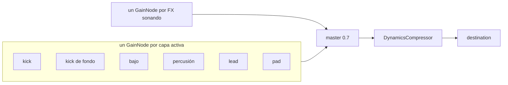

# psy-sampler

Sampler de capas de psytrance para entrenar el oído, en `https://psy.agu.com.ar`.
Cada botón pone en loop una capa (kick, bajo, percusión, lead, pad) sobre una
grilla de 32 semicorcheas (2 compases); los FX son one-shots fuera del loop.
Todo el audio se sintetiza en el browser con Web Audio: el pod sólo sirve ~20 kB
de estáticos.

| Pieza | Dónde |
|---|---|
| Código (Vite + JS vanilla, sin dependencias de runtime) | [`images/psy-sampler/`](../images/psy-sampler) |
| Chart (nginx) | [`charts/psy-sampler/`](../charts/psy-sampler) |
| Argo CD Application | [`apps/psy-sampler.yaml`](../apps/psy-sampler.yaml) |
| Auto-update de la imagen | [`psy-sampler-imageupdater.yaml`](../charts/argocd-image-updater/templates/psy-sampler-imageupdater.yaml) |
| CI | [`psy-sampler-test.yml`](../.github/workflows/psy-sampler-test.yml) (lint + tests + build), [`psy-sampler-image.yml`](../.github/workflows/psy-sampler-image.yml) (imagen arm64 → GHCR) |

## Motor de audio



### Scheduler (lookahead)

| Parámetro | Valor | Para qué |
|---|---|---|
| `TICK_MS` | 25 ms | período del `setInterval` |
| `LOOKAHEAD` | 120 ms | cuánto se agenda por delante de `ctx.currentTime` |
| `SAFETY` | 15 ms | nada se agenda más cerca que esto (ver gotchas) |
| `FADE` | 30 ms | fade lineal de un lane al cambiar variante (en el próximo paso) o al parar (ya) |
| `START_DELAY` | 60 ms | dónde cae el paso 0 al arrancar |

Cada tick lee `stepDuration(bpm) = 60 / BPM / 4`, así el slider aplica en vivo.
El tiempo del próximo paso siempre es el del anterior + la duración vigente
cuando se agendó, así que un cambio de BPM sólo estira los pasos desde el cursor:
lo ya agendado no se mueve y la grilla no deriva. Medido en Chromium (145 → 175
BPM): intervalos de kick de ~413 ms, **un** beat de transición intermedio (p. ej.
378 ms = dos semicorcheas ya agendadas a 145 + dos a 175) y después ~343 ms.

La lógica pura (`collectSteps`, `nextBeatTime`) vive en
[`timing.js`](../images/psy-sampler/src/audio/timing.js), sin Web Audio, y está
testeada aparte.

### Por qué lanes y no cancelar notas

Las notas de la variante vieja que ya están agendadas (hasta 120 ms adelante) y
las colas largas (pad, lead) no se tocan una por una: al cambiar de variante el
**lane entero** hace un fade de 30 ms y se abre uno nuevo. Las notas viejas suenan
dentro del fade y mueren solas.

- El lane nuevo hace **backfill** de los pasos que ya estaban en la ventana de
  lookahead (respetando `SAFETY`), así la variante nueva entra en el paso
  siguiente en vez de dejar un hueco de hasta 120 ms.
- El fade del lane viejo arranca **en ese mismo paso**, no en el clic: el cambio
  es un crossfade cuantizado a la grilla, sin hueco de silencio entre variantes.
  `Parar` sí corta ya (fade inmediato).
- Pad y lead melódico se re-disparan cada 16 / 8 pasos; al entrar a mitad de
  frase arrancan la nota en curso con lo que le queda (`notesAt(…, entering)`), en
  vez de esperar hasta ~1,6 s en silencio.

Selección → lanes es un reconcile puro
([`selection.js`](../images/psy-sampler/src/selection.js)): `desiredLanes()`
calcula el estado deseado y `engine.setLanes()` cierra/abre la diferencia. El
kick de fondo es un lane derivado: suena sólo si hay otra capa activa y ninguna
variante de kick elegida (nunca solo, nunca duplicado).

## Capas

| Capa | Variante | Qué es |
|---|---|---|
| Kick | Punchy corto | seno 170→50 Hz en 70 ms, decay 200 ms + click de ruido HP 3 kHz |
| | Cuerpo largo | seno 120→42 Hz en 160 ms, decay 340 ms |
| Bajo (saw + LP con envolvente, La1 = 55 Hz) | Offbeat | paso % 4 == 2 |
| | Rolling | paso % 4 != 0 (3 notas entre kicks) |
| | Rolling con octava | igual, la del paso % 4 == 2 una octava arriba |
| Percusión (ruido filtrado) | Hi-hat abierto | contratiempo, HP 7 kHz, 140 ms |
| | Shaker | cada paso, acento en las corcheas (pasos pares) |
| | Clap | beats 2 y 4, BP 1,8 kHz, doble ráfaga a 12 ms |
| Lead | Ácido | saw, LP Q 14, cutoff base que deriva 300 Hz ↔ 1,5 kHz cada 16 s (reloj de audio, no del loop) + envolvente por nota; línea de 16 pasos en La menor con silencios y acentos |
| | Arpegio | square, La-Do-Mi-La por semicorchea |
| | Melódico | saw sostenida con vibrato retardado, una nota cada 8 pasos (La-Do-Sol-Mi) |
| Pad | La menor | La3-Do4-Mi4 × 2 saws ±7 cents, LP 1,4 kHz, ataque lento, re-dispara cada 16 pasos con release solapado |
| FX | Riser | ruido BP 300→9000 Hz en 2 compases, ganancia exponencial creciente |
| | Riser + impacto | el impacto cae justo al final del riser |
| | Downlifter | ruido BP 8 kHz→150 Hz + seno 400→40 Hz, 1 compás |
| | Sweep de ruido | BP angosto que sube y baja en 1 compás |
| | Impacto | seno 90→28 Hz + ruido LP |

Los FX duran según el BPM al momento del disparo. Con el loop andando entran en
el próximo beat (el impacto del riser cae en beat); con el loop parado, ya.

### Mezcla

Niveles medidos con un render offline por la misma cadena (lane → master →
compresor), 2 vueltas del loop a 145 BPM:

| | pico dBFS | RMS dBFS |
|---|---|---|
| kick | -2 / -3 | -20 / -18 |
| bajo | -3 | -22 / -17 |
| percusión | -6 / -7 | -33 |
| ácido / arpegio / melódico | -5 / -10 / -8 | -21 / -24 / -20 |
| pad | -9 | -20 |
| 5 capas + riser+impacto + impacto | -0,9 | -14 |

El compresor está suave a propósito (-10 dB, 4:1, knee 6, 3 ms / 150 ms): los
defaults de Web Audio (-24 dB, 12:1) aplastarían la dinámica que una capa en solo
tiene que dejar oír.

## Deploy

Mismo pipeline que `agu-spa`: push a `main` que toque `images/psy-sampler/` →
`psy-sampler-image.yml` publica `ghcr.io/frodoagu/psy-sampler:latest` (+
`sha-<commit>`) → Image Updater pinea `latest@sha256:…` en
`charts/psy-sampler/values.yaml` → Argo CD sincroniza.

### Primer deploy: el paquete de GHCR tiene que ser público

`imagePullSecrets: []`: la imagen sólo contiene lo que cualquiera baja de
`psy.agu.com.ar`, así que no hay nada que proteger. GHCR crea el paquete
**privado** en el primer push; hasta cambiarlo el pod queda en `ImagePullBackOff`:

1. Mergear; esperar el run de `psy-sampler-image.yml`.
2. GitHub → Packages → `psy-sampler` → Package settings → Change visibility →
   **Public**.
3. El kubelet reintenta solo (backoff ≤ 5 min), o
   `kubectl -n psy-sampler rollout restart deploy/psy-sampler`.

Para dejarlo privado: sellar un `ghcr-creds` docker-registry en el namespace
`psy-sampler` (ver [secrets.md](secrets.md)) y listarlo en `imagePullSecrets`.

### DNS

- `psy.agu.com.ar` está en `cloudflare-ddns` (registro A, proxied).
- **No** está en los `localRecords` de Pi-hole, a propósito: esos registros se
  renderizan como env del Deployment de Pi-hole (`strategy: Recreate`), así que
  agregar un host reinicia Pi-hole y corta DNS + DHCP de la LAN durante el rollout.
  Para 20 kB de estáticos el atajo no aporta nada; desde la LAN resuelve a
  Cloudflare, igual que `shelly` y `yaskia.com`.
- Probe de blackbox (`blackboxTargets.public`) para uptime + vencimiento de TLS.

## Desarrollo y tests

```bash
cd images/psy-sampler
npm install
npm run dev      # http://localhost:5173
npm run lint
npm test         # Vitest
npm run build
```

- Lógica pura en `.js` con su `*.test.js` al lado: `timing`, `patterns`, `music`,
  `selection`.
- `voices.test.js` / `engine.test.js` corren contra un `AudioContext` falso
  ([`src/test/fakeAudio.js`](../images/psy-sampler/src/test/fakeAudio.js)) que
  registra nodos y automatizaciones. Incluye un invariante anti-clic: toda fuente
  audible tiene que arrancar y terminar en ganancia 0 y no frenar antes de que su
  envolvente llegue a 0.
- `app.test.js` (jsdom) cubre modo solo / combinar, Parar, kick de fondo y FX.
- Las devDependencies (Vite 8, Vitest 5, jsdom 29) son más nuevas que las de
  `home-site`: las de allá arrastran advisories críticos en el toolchain de test.

## Gotchas

- **Nada se agenda en el pasado.** Una nota cuyo `start` ya pasó cuando la ve el
  audio thread arranca a mitad de la envolvente (ganancia ≠ 0): clic. Por eso
  `SAFETY` aplica al backfill y al catch-up.
- **Pestaña en segundo plano.** Chrome lleva los timers a ≥ 1 s por tick; el
  scheduler salta los pasos perdidos manteniendo la fase de la grilla (no dispara
  el backlog de golpe), pero el loop suena entrecortado. Es una limitación del
  `setInterval` en el main thread; moverlo a un Worker la resolvería.
- **`AudioContext` recién en el primer clic** (autoplay policy). `ensureContext()`
  se llama sincrónico dentro del handler y hace `resume()` si está `suspended`.
- **`listen [::]:80`** en la config de nginx (como `agu-spa`) falla en un host sin
  IPv6 (p. ej. un Docker de prueba); en el Pi anda.
